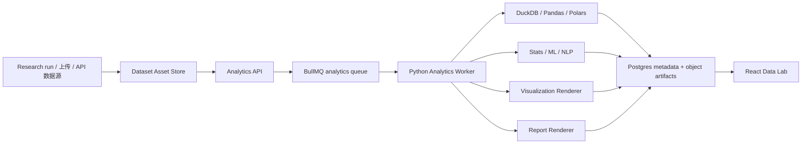

# PolitiStream 数据处理、统计分析与 AI 可视化增强方案

更新时间：2026-06-07
定位：在已有深度爬虫与 Research run 之上，新增一个“Data Lab + Analysis Agent + Visualization Studio + Report Studio”的数据能力层，让系统不止会抓，还能把新闻、网页、表格、数据集、比赛/平台数据处理成可分析、可制图、可复现、可发表的研究资产。

## 1. 结论先行

PolitiStream 后续的数据能力目标应该定为“SPSS Pro 以上 + Python/R/SQL 可复现 + AI 辅助分析 + 论文/工程/交互制图”。也就是说：

- 对新闻：能去重、聚类、分类、筛选、抽实体、建时间线、做来源质量分析、做立场/情绪/冲突分析。
- 对结构化数据：能做 schema 推断、质量评估、清洗转换、统计检验、回归、聚类、分类、时间序列、机器学习和深度学习。
- 对图表：能生成论文级静态图、交互式仪表盘图、地图、关系网络、工程图、架构图、报告信息图。
- 对报告：能导出 Markdown、HTML、DOCX、PDF、PPTX，且所有数据图和结论都能追溯到数据资产、字段、过滤条件和代码。
- 对 AI：AI 负责规划、解释、生成代码和图表建议；事实图表必须由真实数据和可复现代码生成，不能用 AI 图片伪造统计图。

推荐架构：

```text
Crawler / Research Run
  -> Dataset Asset Store
  -> Python Analytics Worker Lane
     -> DuckDB / Polars / Pandas / NumPy
     -> SciPy / statsmodels / scikit-learn / PyTorch
     -> Great Expectations / Pandera / YData Profiling / Evidently
     -> Matplotlib / Seaborn / Plotly / Altair / ECharts / D3 / Graphviz / PyVista
     -> Quarto / Jupyter / nbconvert
  -> Express Analytics API
  -> React Data Lab / Visualization Studio / Agent Console
```

## 2. 现有仓库事实

- 当前项目已经有 `docs/data-processing-analytics-visualization-platform-plan-2026-06-07.md`，覆盖了基础 Data Lab、Python worker、统计分析和可视化方向。
- 当前项目已有 `workers-analytics/pyproject.toml`，已声明 DuckDB、Pandas、Polars、PyArrow、NumPy、SciPy、statsmodels、scikit-learn、Matplotlib、Seaborn、Plotly 等依赖，并把 PyTorch、Transformers、SHAP、Pandera、YData Profiling、Great Expectations、Evidently、GeoPandas、Jupyter、nbconvert、python-pptx 放在可选 extras 中。
- 当前 TypeScript 侧已有 `src/server/analytics/types.ts`，包含 analytics capability、dataset asset、dataset profile、visualization suggestion、descriptive statistics 等基础类型。
- 当前前端已有 `src/components/DataLab.tsx` 和 `src/components/AgentConsole.tsx`，说明入口已经开始搭建，但距离“SPSS+ 数据实验室”和“论文/工程制图工作台”还有明显差距。

本方案是上述基础方案的增强版，重点补上：统计软件级 GUI、数据质量治理、AI 辅助分析执行闭环、可视化引擎路由、论文/工程图输出、报告资产化，以及前端入口设计。

## 3. 产品目标与边界

### 3.1 目标

1. 用户从搜索/爬虫得到新闻集合、网页正文、PDF、表格、CSV、JSON、Excel、Parquet、GeoJSON 等内容后，可以一键进入 Data Lab。
2. 用户不写代码也能完成 SPSS 常见分析：描述统计、交叉表、相关、t 检验、卡方、ANOVA、回归、非参数检验、缺失值分析、因子/主成分、聚类。
3. 高级用户可以看到并复用系统生成的 SQL/Python/R 代码。
4. AI 可以根据研究问题自动推荐分析路径、变量、统计方法和图表，但执行必须走可追溯代码。
5. 系统可以输出论文级图表、工程制图、交互式图表、信息图、报告和 PPT。
6. 每个结论都能回溯到数据版本、字段、过滤条件、代码、运行日志和来源。

### 3.2 边界

- 不把 AI 生成图片当作事实数据图。
- 不让 AI 直接编造统计结论。
- 不在 Node API 进程内执行重型 Python 分析。
- 不混用系统 Python/Homebrew Python；Python 分析环境用 `uv` 或 conda 独立管理。
- 不在第一版实现完整商业 BI 系统；Superset/Metabase 这类工具先作为可选参考或外部集成。

## 4. 能力矩阵：SPSS Pro 以上

IBM SPSS Statistics 当前定位包含高级分析、预测建模、回归、预测、数据准备、AI 辅助解释、决策树、神经网络和市场研究能力。PolitiStream 不需要复制它的桌面软件形态，而是要复制并超越它的分析闭环。

| 能力层 | SPSS 类能力 | PolitiStream 增强目标 | 推荐引擎 |
|---|---|---|---|
| 数据导入 | CSV、Excel、SAV、数据库 | 爬虫资产、网页表格、CSV/JSON/Excel/Parquet/GeoJSON/API 全部入库 | DuckDB、Pandas、Polars、PyArrow |
| 数据准备 | 类型转换、缺失处理、变量计算 | schema 推断、质量评分、清洗 recipe、lineage | Pandera、Great Expectations、YData Profiling |
| 描述统计 | 均值、频数、交叉表 | 自动 profile、异常值、分布、分组对比 | Pandas、DuckDB、SciPy |
| 假设检验 | t 检验、卡方、ANOVA、非参数 | GUI 向导 + 可复现代码 + 中文解释 | SciPy、statsmodels |
| 回归建模 | 线性、逻辑、广义线性 | OLS/GLM/Logit/Poisson/稳健标准误/诊断图 | statsmodels、scikit-learn |
| 多变量分析 | PCA、因子、聚类 | 降维、聚类、文本 embedding 聚类 | scikit-learn、UMAP、HDBSCAN |
| 预测建模 | 决策树、神经网络 | 分类、回归、交叉验证、模型评估、特征重要性 | scikit-learn、PyTorch、SHAP |
| 时间序列 | 预测、趋势 | 趋势、季节性、事件影响、异常检测 | statsmodels、sktime 可选 |
| 文本分析 | 基础文本处理 | 新闻聚类、主题模型、情绪/立场、实体图谱 | spaCy、sklearn、Transformers、LLM |
| 报告输出 | 表格和图 | HTML/DOCX/PDF/PPTX + 图表源码 + 数据溯源 | Quarto、Jupyter、nbconvert、Pandoc |

借鉴 jamovi/JASP/PSPP 的点：

- jamovi 的“点选分析 + R syntax 可复制”模式很适合本项目：前端给低门槛 GUI，后端保留可复现 Python/R/SQL。
- JASP 的经典统计 + Bayesian 统计体验值得参考，但第一版 Bayesian 可设为 planned。
- PSPP 对 SPSS 文件和常见统计过程的开源兼容可作为 `.sav` 文件支持的参考。

## 5. 数据资产模型

数据处理必须先把爬取结果资产化。建议统一抽象为 `DatasetAsset`。

```text
DatasetAsset
  id
  name
  source_kind: research_run | rss_archive | upload | api | crawler | manual
  source_ref
  original_format: html_table | csv | json | jsonl | excel | parquet | pdf_table | geojson | api_records
  storage_uri
  row_count
  column_count
  schema_version
  license
  collected_at
  transformed_from
  metadata
```

建议新增或补强数据表：

```text
analytics_dataset_assets
dataset_snapshots
dataset_schemas
dataset_profiles
dataset_quality_reports
dataset_cleaning_recipes
analysis_jobs
analysis_runs
analysis_artifacts
statistical_results
model_results
visualization_specs
visualization_artifacts
report_artifacts
news_story_clusters
news_topic_labels
entity_graph_snapshots
```

关键原则：

- 原始数据、清洗数据、分析结果分层保存。
- 每次转换都记录 `input_asset_id`、`output_asset_id`、代码、参数、运行时间、错误和依赖版本。
- 前端永远不要加载超大数据全量，只加载 schema、profile、抽样、聚合结果或分页预览。

## 6. 新闻原文处理能力

新闻处理不能只做 AI 摘要，应拆成可复现的 pipeline。

```text
News documents
  -> canonicalization
  -> duplicate detection
  -> story clustering
  -> topic classification
  -> entity extraction
  -> source scoring
  -> timeline
  -> stance / sentiment
  -> claim / evidence link
  -> visual report
```

| 模块 | 目标 | 方法 |
|---|---|---|
| 新闻去重 | 合并同一新闻的转载、标题改写和镜像页 | URL canonical、content hash、SimHash/MinHash、embedding similarity |
| Story clustering | 把同一事件聚成一个 story | 标题/摘要 embedding、时间窗口、实体重叠 |
| 主题分类 | 政策、公司、科技、金融、体育、公共安全等 | 规则标签 + sklearn 分类器 + LLM 校正 |
| 实体抽取 | 人物、机构、公司、地点、产品、法案、比赛 | spaCy/Transformers/LLM，输出 entity graph |
| 来源质量 | 官方、主流、行业、博客、社交、论坛、数据源 | source profile + authority tier |
| 时间线 | 事件发生、首次报道、更新、引用链 | publish time、modified time、Wayback/GDELT 辅助 |
| 立场/情绪 | 正负面、支持/反对、风险信号 | sentiment + stance classifier |
| 冲突检测 | 同一 claim 的互相支持/反驳 | claim/evidence graph |

新闻分析输出：

- 主题趋势图。
- 来源分布图。
- 事件时间线。
- 实体关系图。
- 来源可信度矩阵。
- 同一事实的支持/反驳证据表。
- 默认简体中文分析报告，原文内容保持原语言。

## 7. 结构化数据处理能力

### 7.1 数据导入

第一版必须支持：

| 格式 | 用途 | 推荐引擎 |
|---|---|---|
| CSV/TSV | 最常见开放数据 | DuckDB、Pandas、Polars |
| JSON/JSONL | API、爬虫输出、日志 | DuckDB JSON、Polars、Node parser |
| Excel/XLSX | 人工数据、报告附件 | SheetJS、openpyxl |
| Parquet/Arrow | 大型列式数据 | DuckDB、PyArrow、Polars |
| HTML table | 网页表格 | JSDOM/Cheerio、Pandas read_html |
| PDF table | 报告表格 | Camelot/Tabula/Unstructured 可选 |
| GeoJSON | 地理空间 | GeoPandas、deck.gl |

第二版扩展：

- Shapefile、Geopackage。
- SDMX（IMF/OECD/Eurostat 类统计 API 常见）。
- XBRL（SEC/财报）。
- NetCDF/HDF5（气象、遥感、科学数据）。

### 7.2 数据剖析

每个 dataset asset 入库后自动生成：

- 行数、列数、字段名、字段类型。
- 缺失率、唯一值、重复行。
- 数值列 min/max/mean/median/std/quantile。
- 类别列 top values、长尾程度。
- 时间列范围、粒度、缺口。
- 地理列坐标范围、CRS、geometry 类型。
- 异常值：IQR、z-score、MAD。
- 数据质量分：完整性、唯一性、一致性、有效性、新鲜度。

### 7.3 清洗转换

需要提供 GUI + code 双入口：

| 清洗能力 | GUI 行为 | 可复现代码 |
|---|---|---|
| 列名标准化 | 一键改 snake_case / 中文保留 | Pandas/Polars rename |
| 类型转换 | 选择日期/数值/类别/布尔 | astype、to_datetime |
| 缺失值处理 | 删除/填补/保留标记 | fillna/dropna |
| 单位换算 | 选择单位与目标单位 | transform recipe |
| 去重 | 选择 key 或 fuzzy key | drop_duplicates / record linkage |
| join | 选择左右表和 key | DuckDB SQL |
| groupby/pivot | 选择分组、指标、聚合 | DuckDB / Polars |
| 时间窗口 | 日/周/月/滚动窗口 | resample / window functions |

所有清洗操作必须保存为 `cleaning_recipe`，允许重跑、复制、回滚。

## 8. 统计分析与机器学习能力

### 8.1 基础统计

| 功能 | 结果 |
|---|---|
| 描述统计 | summary table、分布图、异常值说明 |
| 频数分析 | frequency table、bar chart |
| 交叉表 | crosstab、百分比、卡方检验 |
| 相关分析 | Pearson/Spearman/Kendall、相关矩阵热力图 |
| t 检验 | 单样本、独立样本、配对样本 |
| ANOVA | 单因素、多因素、事后检验 |
| 非参数检验 | Mann-Whitney、Wilcoxon、Kruskal-Wallis |

### 8.2 回归与建模

| 功能 | 引擎 | 输出 |
|---|---|---|
| 线性回归 | statsmodels OLS | 系数表、置信区间、残差诊断 |
| 逻辑回归 | statsmodels/sklearn | odds ratio、ROC/AUC、混淆矩阵 |
| 广义线性模型 | statsmodels GLM | link function、deviance、AIC/BIC |
| 随机森林/GBDT | sklearn/LightGBM 可选 | 特征重要性、交叉验证 |
| 聚类 | sklearn/HDBSCAN | cluster labels、轮廓系数、降维图 |
| PCA/UMAP | sklearn/umap-learn | 主成分解释率、二维投影 |
| 时间序列 | statsmodels/sktime 可选 | 趋势、季节性、预测区间 |
| 深度学习 | PyTorch | 文本分类、embedding、表格模型 |

### 8.3 文本与新闻机器学习

- TF-IDF + 逻辑回归/线性 SVM：适合可解释主题/分类 baseline。
- Sentence embeddings + HDBSCAN：适合 story clustering。
- BERTopic 可选：适合主题发现。
- PyTorch/Transformers：适合文本分类、实体抽取、立场判断。
- LLM：适合少样本标签归纳、claim 抽取、摘要和报告，但必须受证据图约束。

## 9. 数据质量与可观测性

调研结论：Great Expectations 适合构建可读的数据质量规则和验证结果；Pandera 更适合 Python DataFrame 内的 schema 校验；YData Profiling 适合自动 EDA；Evidently 适合数据漂移和模型监控。

建议分层：

```text
Dataset profile
  -> lightweight built-in profile
  -> ydata-profiling full report

Dataset validation
  -> pandera schema checks
  -> Great Expectations suite

Long-running monitoring
  -> Evidently drift / data quality dashboard
```

Data quality score：

| 维度 | 权重 |
|---|---:|
| 完整性 | 20% |
| 类型一致性 | 15% |
| 唯一性/重复率 | 10% |
| 范围合理性 | 15% |
| 时间新鲜度 | 10% |
| 来源权威性 | 15% |
| Schema/单位清晰度 | 10% |
| License 可用性 | 5% |

## 10. 可视化与制图体系

### 10.1 图表分层

| 层级 | 目的 | 推荐工具 |
|---|---|---|
| 快速探索图 | 数据预览、变量关系、分布 | ECharts、Observable Plot、Vega-Lite |
| 统计图 | 分布、回归、相关、置信区间 | Seaborn、Matplotlib |
| 交互图 | 前端 dashboard、筛选、hover、zoom | Plotly、ECharts、Vega-Lite |
| 大规模地图 | 多点、多边形、轨迹、热力 | deck.gl、GeoPandas、kepler.gl 可选 |
| 网络图 | 来源网络、实体图谱、证据图 | NetworkX、Graphviz、Cytoscape.js |
| 工程图 | 结构、参数、3D mesh、曲面 | Matplotlib、Plotly 3D、PyVista、Graphviz |
| 架构图 | 系统流程、依赖、数据流 | Mermaid、Graphviz |
| 信息图 | 报告封面、概念示意、视觉叙事 | Canva/Figma、canvas-design、imagegen |

### 10.2 统一 VisualizationSpec

```json
{
  "id": "viz_001",
  "dataset_asset_id": "dataset_123",
  "kind": "bar | line | scatter | box | heatmap | map | network | timeline | engineering | diagram | infographic",
  "engine": "matplotlib | seaborn | plotly | altair | echarts | vega-lite | d3 | graphviz | mermaid | pyvista",
  "encoding": {
    "x": "date",
    "y": "count",
    "color": "source_type",
    "facet": "topic"
  },
  "transform": {
    "filter": [],
    "groupby": ["date", "source_type"],
    "aggregate": [{"field": "id", "op": "count", "as": "count"}]
  },
  "style": {
    "theme": "paper | dashboard | presentation | dark",
    "language": "zh-CN",
    "font": "Noto Sans CJK SC",
    "source_caption": true
  },
  "exports": ["png", "svg", "pdf", "html", "json"]
}
```

### 10.3 论文级图表要求

每张论文图都要有：

- 明确标题、坐标轴、单位、图例、数据来源。
- 字体、字号、线宽、DPI、图幅比例模板。
- SVG/PDF 矢量导出优先，PNG 仅作预览。
- 图注和数据处理说明。
- 生成代码和输入数据版本。

建议建立主题模板：

```text
paper_zh_cn
paper_en
dashboard_light
dashboard_dark
presentation_16_9
engineering_mono
```

### 10.4 工程制图

工程图不是普通柱状图，需要支持：

- 参数曲线、相图、等高线、3D 曲面。
- 网络拓扑、流程、依赖图。
- 坐标/单位/比例尺。
- SVG/PDF 高精度输出。
- 可选 3D mesh/volume 数据渲染。

工具建议：

- Matplotlib：2D 工程曲线、等高线、矢量图。
- Plotly 3D：交互式 3D 曲面、点云。
- PyVista：科学计算和工程 3D mesh、volume、finite element 结果。
- Graphviz：依赖图、DAG、数据流图、证据图。
- Mermaid：轻量流程图、架构图，适合报告。

## 11. AI 辅助分析与 AI 制图

### 11.1 AI 应该做什么

| AI 角色 | 具体行为 |
|---|---|
| Analysis Planner | 根据用户问题拆变量、指标、时间范围、统计方法 |
| Data Interpreter | 解释字段含义、单位、异常和缺失 |
| Code Generator | 生成 SQL/Python/R/VisualizationSpec |
| Code Reviewer | 检查字段是否存在、方法是否匹配、是否数据泄漏 |
| Chart Recommender | 根据字段类型和分析目的推荐图表 |
| Chart Critic | 检查图表是否误导、坐标轴/单位/图例是否完整 |
| Report Writer | 基于已验证结果生成中文解释和报告 |
| Infographic Designer | 生成非事实型封面、示意图、视觉辅助 |

### 11.2 AI 不能做什么

- 不能伪造样本量、p 值、回归系数、图表数据。
- 不能把 AI 生成图片当统计图。
- 不能绕过数据质量失败继续输出确定性结论。
- 不能隐藏分析代码、过滤条件和数据来源。
- 不能对敏感数据做不必要的外发。

### 11.3 借鉴 AI 可视化工具

| 工具/项目 | 借鉴点 | PolitiStream 用法 |
|---|---|---|
| Microsoft Data Formulator | UI + 自然语言混合的可视化探索，AI 负责数据转换和 Vega-Lite 图表 | 借鉴“可视化线程 + lineage + 预览 + 修改”交互 |
| Microsoft LIDA | 数据摘要、目标探索、可视化代码生成、图表解释、自评和修复 | 借鉴多阶段 chart agent，不直接照搬执行模型 |
| PyGWalker | Pandas DataFrame 转交互式探索 UI | 可作为 notebook/worker 内部探索参考 |
| Superset | SQL Lab + no-code chart builder + dashboard | 后续可作为外部 BI 集成或产品参考 |

## 12. 前端产品设计

### 12.1 总入口

建议前端主导航变为：

```text
搜索 / 深度研究
新闻监控
数据实验室 Data Lab
可视化工作台 Visualization Studio
报告中心 Report Studio
Agent Console
设置
```

### 12.2 Data Lab

布局：

```text
左侧：数据资产 / 新闻集合 / research run / 已保存分析
中间：数据预览 / profile / 统计结果 / 图表
右侧：分析向导 / 字段选择 / 参数 / 导出
```

功能：

- 数据集列表、来源、格式、质量分。
- 表格预览、schema、profile。
- 清洗步骤编辑器。
- SPSS 风格分析向导。
- 分析历史和重跑。
- 生成代码查看。

### 12.3 Analysis Wizard

交互流程：

```text
选择数据集
  -> 选择分析类型
  -> 选择变量和分组
  -> 参数设置
  -> 系统检查适用性
  -> 运行 worker
  -> 输出结果表 / 图 / 中文解释 / 代码
```

分析类型：

- 描述统计。
- 频数和交叉表。
- t 检验。
- 卡方检验。
- ANOVA。
- 相关分析。
- 线性/逻辑回归。
- 聚类。
- 时间序列。
- 文本分类/主题聚类。

### 12.4 Visualization Studio

功能：

- 图表推荐。
- 图表编辑器：字段、聚合、过滤、颜色、分面、主题。
- 图表预览：ECharts/Plotly/Vega-Lite。
- 论文图导出：Matplotlib/Seaborn -> SVG/PDF/PNG。
- 工程图导出：Graphviz/Mermaid/PyVista。
- 图表版本和复现代码。

### 12.5 News Analysis Studio

针对新闻集合：

- Story clusters。
- 主题分布。
- 来源类型和可信度。
- 时间线。
- 实体关系图。
- 立场/情绪分布。
- 冲突证据表。

### 12.6 Report Studio

报告组成：

- 研究摘要。
- 数据来源说明。
- 数据质量说明。
- 方法说明。
- 统计结果表。
- 图表和图注。
- 局限性。
- 参考来源。
- 附录：代码、字段表、运行参数。

导出：

- Markdown。
- HTML。
- DOCX。
- PDF。
- PPTX。

## 13. 后端架构

### 13.1 Worker 分层



### 13.2 API 建议

```text
GET  /api/analytics/capabilities

GET  /api/datasets
POST /api/datasets
GET  /api/datasets/:id
POST /api/datasets/:id/profile
POST /api/datasets/:id/validate
POST /api/datasets/:id/clean
POST /api/datasets/:id/query

POST /api/analysis/jobs
GET  /api/analysis/jobs
GET  /api/analysis/jobs/:id
POST /api/analysis/jobs/:id/run
POST /api/analysis/jobs/:id/cancel

POST /api/visualizations
GET  /api/visualizations/:id
POST /api/visualizations/:id/render
GET  /api/visualizations/:id/export?format=png|svg|pdf|html|json

POST /api/news-analysis/runs/:runId/cluster
POST /api/news-analysis/runs/:runId/timeline
POST /api/news-analysis/runs/:runId/source-quality

POST /api/reports
GET  /api/reports/:id
POST /api/reports/:id/render
GET  /api/reports/:id/export?format=md|html|docx|pdf|pptx
```

### 13.3 队列

```text
analytics.profile
analytics.validate
analytics.clean
analytics.statistics
analytics.ml
analytics.news
analytics.visualize
analytics.report
```

每个 job 都要有：

- 输入 dataset ids。
- 分析类型。
- 参数。
- worker version。
- dependency snapshot。
- 状态：queued/running/succeeded/failed/cancelled。
- artifacts。
- logs。

## 14. Python 环境与依赖

建议继续使用 `workers-analytics/`，用 `uv` 管理：

```bash
cd workers-analytics
uv sync
uv run politistream-analytics-worker profile --input sample.json --output profile.json
```

第一批基础依赖：

```text
duckdb
pandas
polars
pyarrow
numpy
scipy
statsmodels
scikit-learn
matplotlib
seaborn
plotly
kaleido
```

质量与 EDA：

```text
pandera
great-expectations
ydata-profiling
evidently
```

机器学习和 NLP：

```text
torch
transformers
sentence-transformers
shap
hdbscan
umap-learn
spacy
bertopic
```

地理和工程图：

```text
geopandas
folium
pyvista
networkx
graphviz
```

报告：

```text
jupyter
nbconvert
quarto
python-pptx
```

注意：

- 不使用 `sudo pip`。
- 不混用系统 Python/Homebrew Python。
- 大依赖如 PyTorch、GeoPandas、PyVista 放 optional extras，避免基础安装太重。
- 所有 API key、模型名、worker 并发、导出目录放 `.env`。

## 15. 本地 Codex Skills 互补

| Skill | 用途 |
|---|---|
| `web-reader-router` | 判断网页/数据源访问边界、抽取完整性、授权替代路径 |
| `xlsx` / `spreadsheets` | 读取、清洗、生成 Excel/CSV 工作簿 |
| `pdf` | PDF 表格/文本抽取、PDF 检查 |
| `doc` / `docx` / `documents` | 生成和检查 Word 报告 |
| `pptx` / `presentations` | 生成研究汇报 PPT |
| `imagegen` | 生成封面、概念图、非事实型配图 |
| `canvas-design` / `theme-factory` | 信息图、视觉主题、报告封面 |
| `frontend-design` | Data Lab、Visualization Studio、Report Studio 前端设计 |

关键边界：

- `imagegen`、`canvas-design` 适合“视觉表达”，不适合“事实图表”。
- 统计图、地图、工程图必须由真实数据和代码渲染。
- 文档/PDF/PPT 导出要保留数据来源和方法说明。

## 16. 分阶段实施计划

### Phase 0：架构定型

目标：把数据能力定义成独立平台层。

任务：

1. 整理现有 `src/server/analytics/*` 和 `workers-analytics/*`。
2. 明确 DatasetAsset、AnalysisJob、VisualizationSpec、ReportArtifact 数据模型。
3. 补 `.env.example`：analytics worker、export dir、Quarto、Python path、chart renderer、AI model。
4. 建立 Python worker 的 `uv.lock` 或 conda 环境说明。

验收：

- `npm run test`、`npm run lint`、`npm run build` 通过。
- `workers-analytics` 能运行 profile/stats CLI。

### Phase 1：Data Lab 基础能力

目标：任意爬取/上传数据可以进入 Data Lab。

任务：

1. Dataset asset 入库与分页预览。
2. schema inference。
3. lightweight profile。
4. descriptive statistics。
5. 基础图表建议。
6. Research run -> Data Lab 导入。

验收：

- CSV/JSON/Excel/网页表格可以生成 profile。
- 前端展示字段、缺失率、样本、质量分。

### Phase 2：SPSS 风格分析向导

目标：不用写代码完成常见统计。

任务：

1. 变量选择器。
2. 描述统计、交叉表、相关、t 检验、卡方、ANOVA、回归。
3. 输出统计表、诊断图、中文解释、可复现 Python 代码。
4. 结果保存为 analysis artifact。

验收：

- 用户选择字段即可运行分析。
- 每个结果可下载 CSV/JSON/Markdown。
- AI 解释必须引用统计结果。

### Phase 3：新闻整理与分类

目标：Research run 和 RSS 新闻可以做系统化内容分析。

任务：

1. 新闻去重和 story clustering。
2. 主题分类。
3. 实体抽取。
4. 时间线生成。
5. 来源质量统计。
6. 情绪/立场初版。

验收：

- 同一事件多篇新闻可以聚类。
- 能展示主题分布、来源分布、时间线和实体图。

### Phase 4：可视化工作台

目标：支持论文图、交互图、地图、网络图、工程图。

任务：

1. VisualizationSpec 表和 API。
2. ECharts/Plotly/Vega-Lite 前端预览。
3. Matplotlib/Seaborn 后端静态图导出 SVG/PDF/PNG。
4. Graphviz/Mermaid 导出架构图和关系图。
5. GeoPandas/deck.gl 地图初版。
6. PyVista 工程 3D 图作为 optional。

验收：

- 至少支持 12 类图表。
- 同一图可以导出 PNG/SVG/PDF/HTML。
- 论文图模板可配置字体、字号、图例、来源注释。

### Phase 5：AI 分析与报告闭环

目标：让 Agent 能调度数据分析和报告生成，但不越权。

任务：

1. Analysis planner：自然语言 -> analysis plan。
2. Chart recommender：自然语言 -> VisualizationSpec。
3. Code generator：生成 SQL/Python，但先过字段和安全检查。
4. Chart critic：检查图表完整性。
5. Report writer：基于 artifacts 生成中文报告。
6. Quarto/Jupyter/Markdown/DOCX/PDF/PPTX 导出。

验收：

- 用户输入“分析过去 30 天某主题新闻的来源变化并画图”，系统能创建分析任务、生成图和报告。
- 报告每个核心结论都能跳回数据、代码和来源。

## 17. 执行安全与可复现

AI 生成代码和 Python worker 是高风险点，必须加入工程护栏：

| 风险 | 护栏 |
|---|---|
| 任意代码执行 | 分析代码运行在隔离 worker；限制文件系统、网络、CPU、内存、超时 |
| 幻觉字段 | 运行前检查字段存在、类型匹配、样本量足够 |
| 统计误用 | 方法选择前检查数据分布、样本量、变量类型，并输出局限 |
| 数据泄漏 | 敏感字段标记、脱敏、外部模型调用前做策略检查 |
| 图表误导 | 检查坐标轴截断、单位、样本量、筛选条件、颜色含义 |
| 不可复现 | 保存数据版本、代码、依赖、参数、随机种子 |
| 大数据拖垮前端 | 前端只取抽样、分页、聚合或 raster/tile |

## 18. 验收标准

1. 任意 Research run 可以导入 Data Lab。
2. CSV/JSON/Excel/HTML table 可以生成 schema profile 和质量报告。
3. 新闻集合可以生成去重 clusters、主题分布、来源分布、时间线。
4. 用户可以通过 GUI 完成描述统计、相关、t 检验、卡方、ANOVA、回归。
5. 每个统计结果有表格、图、中文解释和可复现代码。
6. 至少支持 12 类图表：bar、line、scatter、histogram、box、heatmap、timeline、network、map、sankey、table、engineering plot。
7. 论文图可导出 SVG/PDF，交互图可导出 HTML。
8. AI 生成报告默认简体中文，爬取原文保持原语言。
9. 所有 AI 结论都能跳转到数据资产、字段、过滤条件、代码和来源。
10. Worker 失败不会阻塞主 API；错误写入 job logs。

## 19. 推荐优先级

最应该先做：

1. DatasetAsset + profile + Data Lab 预览。
2. Python worker 与 Node API 队列联通。
3. 描述统计、相关、回归、基础图表导出。
4. 新闻去重/聚类/时间线。
5. VisualizationSpec 和 ECharts/Plotly/Matplotlib 渲染。

暂缓：

- 完整 R worker。
- 完整 Bayesian 分析。
- PyVista 复杂 3D 工程图。
- Superset/Metabase 内嵌。
- 自动训练大型深度学习模型。

## 20. 调研来源

### 统计软件与 GUI 参考

- IBM SPSS Statistics：<https://www.ibm.com/products/spss-statistics>
- GNU PSPP：<https://www.gnu.org/software/pspp/pspp.html>
- PSPP Manual：<https://www.gnu.org/software/pspp/manual/pspp.html>
- jamovi User Guide：<https://www.jamovi.org/user-manual.html>
- jamovi Features：<https://www.jamovi.org/features.html>
- JASP：<https://jasp-stats.org/>

### Python / 数据处理 / 统计 / ML

- DuckDB Python API：<https://duckdb.org/docs/stable/clients/python/overview>
- Polars Lazy API：<https://docs.pola.rs/user-guide/concepts/lazy-api/>
- Pandas IO tools：<https://pandas.pydata.org/pandas-docs/stable/user_guide/io.html>
- NumPy quickstart：<https://numpy.org/doc/stable/user/quickstart.html>
- SciPy stats：<https://docs.scipy.org/doc/scipy/reference/stats.html>
- statsmodels regression：<https://www.statsmodels.org/stable/regression.html>
- scikit-learn User Guide：<https://scikit-learn.org/stable/user_guide>
- PyTorch docs：<https://docs.pytorch.org/docs/stable/>

### 数据质量与自动 EDA

- Great Expectations expectations：<https://docs.greatexpectations.io/docs/cloud/expectations/expectations_overview/>
- Pandera DataFrame Schemas：<https://pandera.readthedocs.io/en/v0.21.1/dataframe_schemas.html>
- YData Profiling docs：<https://docs.profiling.ydata.ai/>
- Evidently data drift：<https://docs.evidentlyai.com/metrics/preset_data_drift>

### 可视化、地图、工程图

- Matplotlib savefig：<https://matplotlib.org/3.7.0/api/_as_gen/matplotlib.pyplot.savefig.html>
- Seaborn：<https://seaborn.pydata.org/>
- Plotly static image export：<https://plotly.com/python/static-image-export/>
- Vega-Lite：<https://vega.github.io/vega-lite/docs/>
- Apache ECharts：<https://echarts.apache.org/>
- D3：<https://d3js.org/what-is-d3>
- Observable Plot transforms：<https://observablehq.com/plot/features/transforms>
- deck.gl：<https://deck.gl/docs>
- NetworkX algorithms：<https://networkx.org/documentation/stable/reference/algorithms/index.html>
- GeoPandas docs：<https://geopandas.org/docs.html>
- PyVista docs：<https://docs.pyvista.org/index.html>
- Graphviz docs：<https://graphviz.org/documentation/>

### 报告与 Notebook

- Quarto Python：<https://quarto.org/docs/computations/python.html>
- Jupyter：<https://jupyter.org/>
- Jupyter kernels：<https://docs.jupyter.org/en/stable/projects/kernels.html>
- nbconvert docs：<https://nbconvert.readthedocs.io/>
- Apache Superset：<https://superset.apache.org/>

### AI 可视化与数据探索

- Microsoft Data Formulator GitHub：<https://github.com/microsoft/data-formulator>
- Microsoft Data Formulator Research Blog：<https://www.microsoft.com/en-us/research/blog/data-formulator-exploring-how-ai-can-help-analysts-create-rich-data-visualizations/>
- Microsoft LIDA：<https://microsoft.github.io/lida/>
- LIDA GitHub：<https://github.com/microsoft/lida>
- LIDA paper：<https://arxiv.org/abs/2303.02927>
- PyGWalker：<https://pygwalker.com/>
