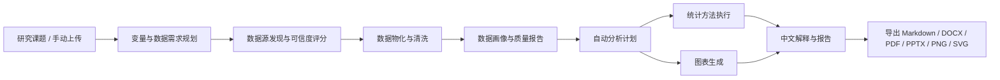

# PolitiStream Data Lab 课题驱动分析链路升级计划

## 1. 目标

Data Lab 不应只是一个“上传表格后点工具”的页面，而要成为 Research 的下游分析引擎：

- 用户输入研究课题后，Research 负责找网页、证据、公开数据源和结构化资料。
- Data Lab 自动把可分析的数据源物化成数据集，并根据课题生成分析问题、变量假设、图表清单和统计方法。
- 用户也可以手动上传 CSV / Excel / JSON / PDF 表格，系统自动解析字段、识别变量类型、推荐图表和统计方法。
- 最终输出包括：数据画像、统计表、特征解释、可视化图片、论文级图表、可复现代码、中文分析报告。

目标体验是：用户说“调研全国避孕套市场”，系统不仅生成文字报告，还能自动寻找市场规模、地区、人群、渠道、出生率、结婚率、电商热度等数据，形成数据集并产出趋势图、地区对比图、相关热力图、分组箱线图、回归分析和结论解释。

## 2. 当前基线

当前项目已经具备以下真实能力：

- Research run 可以导出 Data Lab 数据源清单，Data Lab 可以从 Research run / data source registry 创建数据集。
- Analytics worker 已支持 profile、stats、quality、frequency、crosstab、tests、regression、logistic、poisson、dimension、cluster、anomaly、timeseries、transform、cleaning、news、text、explain、deepml、geo、chart、report、export。
- 后端已能生成 PNG / SVG / PDF / DOCX / PPTX 等分析产物。
- 前端已有 Data Lab 多页面结构，包括导入、数据集、分析向导、可视化、数据源、活动、系统状态等页面。
- 仍然不足的是：课题驱动的数据分析规划不够强，用户不知道下一步该点什么；自动图表/统计推荐仍偏基础；Research 抓到的数据源与 Data Lab 的分析链路需要更明确地打通。

### 2.1 当前真实代码落点

这次改动不是从零搭，而是在已有代码上把“Research -> 分析机会评估 -> Data Lab”接起来：

- `src/components/ResearchPanel.tsx`：已经有 Research run、Source Explorer、文档检索、新闻分析、导出到 Data Lab、生成数据源清单等入口。
- `src/components/DataLab.tsx`：已经承载 Data Lab 首页、导入、数据集、分析向导、统计建模、图表报告、数据源资产、任务产物、系统接口等页面。
- `src/components/data-lab/DataLabAnalysisWizard.tsx`：已经有分析向导的独立组件，适合接收 Research 的课题上下文。
- `src/server/research/analysis.ts`：已经在做网页相关性判断和证据抽取，可以扩展为“分析机会评估”的一部分。
- `src/server/analytics/researchDataSources.ts` 与 `src/server/analytics/sourceMaterializer.ts`：已经支持从 Research 数据源物化出可分析数据集。
- `src/server/analytics/engine.ts`、`workers-analytics/politistream_analytics/advanced.py`：已经是分析 worker 和图表/报告能力的实际执行层。

## 3. 目标链路



### 3.1 用户操作主线

Data Lab 的产品主线固定为 6 步，所有页面、按钮和 API 都围绕这 6 步组织：

1. **确定问题**：从 Research run 带入课题，或用户在 Data Lab 里输入一个分析问题。
2. **准备数据**：上传文件、粘贴 JSON rows、从 Research 数据源清单物化数据集。
3. **理解数据**：自动 profile，展示字段类型、缺失、异常、样本量、数据质量。
4. **生成计划**：按课题和字段生成分析问题、变量角色、方法链、图表清单。
5. **执行分析**：用户点选方法或“一键运行整套流程”，后端 worker 执行确定性统计/建模/制图。
6. **交付结果**：图表、统计表、结论解释、局限性、可复现代码、导出文件统一进入 artifacts。

### 3.2 Research 到 Data Lab 的闭环

Research 页面不只负责“导出数据集”，还要明确告诉用户下一步能做什么：

- 在 Research 的 Provider Panel 增加 **生成数据源清单** 按钮，输出 data-catalog、structured-api、competition-data、sports-data、table、PDF、HTML table 等候选。
- 在 Source Explorer 增加 **发送到 Data Lab** 按钮，允许单个 URL 或一组 URL 进入数据物化。
- 在报告页增加 **基于本报告做数据分析** 按钮，携带 topic、runId、reportId、evidenceIds 到 Data Lab。
- Data Lab 接收后先进入“数据源资产”页，再提示用户物化数据集、生成 profile、创建分析计划。

### 3.3 是否进入数据分析的决策门

不是所有课题都需要 Data Lab。Research 完成后，系统必须先生成一个 **分析机会评估**，再让用户选择是否进入数据分析。

分析机会评估回答三个问题：

1. **这个课题可能需要哪些数据特征**
   - “全国避孕套市场”应识别：市场规模、销量、地区、渠道、厂商营收、购买频率、年龄、人群婚育状态、出生率、结婚率、电商搜索热度。
   - “好用的文档编辑工具”应识别：官方文档、GitHub stars、release 频率、license、兼容格式、社区评价、价格；多数情况下只需要对比报告，不需要进入 Data Lab。

2. **当前爬虫结果是否足够做数据分析**
   - 如果只有网页介绍、产品功能、社区观点，提示“适合生成研究报告，不建议强行做统计分析”。
   - 如果抓到了表格、PDF 财报、CSV、API、地区/时间/人群/金额等字段，提示“建议进入 Data Lab”。
   - 如果有方向但缺关键字段，提示“可进入轻量分析，但需要继续补抓数据源”。

3. **如果继续分析，应该先分析什么**
   - 轻量分析：字段画像、描述统计、频数、交叉表、基础图表。
   - 标准分析：趋势、地区差异、渠道结构、相关性、分组箱线图。
   - 深度分析：回归、聚类、时间序列、地理分析、论文图表和扩展报告。

Research 报告页的默认决策按钮：

- **仅生成研究报告**：不进入 Data Lab，只保留报告、证据表和来源列表。
- **进入轻量分析**：把可结构化内容导入 Data Lab，只做 profile、统计摘要和基础图表。
- **进入完整分析**：进入 Data Lab，生成分析计划、执行 worker、导出图表和报告。
- **先看建议再决定**：打开分析建议抽屉，展示“能分析什么、不能分析什么、缺什么数据”。

### 3.4 Research -> Data Lab 转场状态机

这条链路要明确成状态机，不然前端按钮和后端 API 很容易各说各话。

1. `research_completed`：Research run 已产出报告、证据和来源列表。
2. `opportunity_generated`：系统为该课题生成 `Analysis Opportunity`。
3. `user_decided`：用户选择 `仅报告 / 轻量分析 / 完整分析 / 继续补抓数据`。
4. `handoff_created`：后端写入 handoff 记录，带着 topic、runId、reportId、字段建议、数据源清单进入 Data Lab。
5. `datalab_ready`：Data Lab 收到上下文，自动停在正确页面，而不是把用户扔回首页。

状态迁移必须是单向的：

- `仅报告` -> 标记 research final，不创建 dataset，不触发 analytics worker。
- `轻量分析` -> 只创建 dataset registry 或轻量 dataset，进入 profile / stats / chart。
- `完整分析` -> 创建 dataset + analysis plan + worker job，进入完整分析向导。
- `继续补抓数据` -> 返回 Research planner，追加子问题和数据源。

### 3.5 分析机会评估规则

`Analysis Opportunity` 不能只靠一句 prompt 让模型拍脑袋，必须有可解释的评分和规则兜底。

建议评分维度：

- 结构化字段密度：是否有年份、地区、金额、频次、销量、人数等数值字段。
- 维度丰富度：是否同时存在地区、时间、渠道、人群、品牌、品类等可分组维度。
- 来源质量：是否来自财报、统计年鉴、官方 API、表格、PDF、GitHub、行业报告等。
- 证据覆盖：可追溯来源是否足够支撑统计，而不是只是一堆观点文章。
- 分析收益：做图、做分组、做趋势、做相关性后是否能明显提升结论质量。
- 课题类型：市场研究、比赛数据、政策分析、经营分析通常更适合 Data Lab；工具对比、产品选型、新闻查证通常更适合报告优先。

建议决策阈值：

- `score >= 0.75` 且至少有 2 个数值字段 + 1 个分组维度：推荐完整分析。
- `0.45 <= score < 0.75` 或字段不完整但还有补抓空间：推荐轻量分析或继续补抓数据。
- `score < 0.45` 且结论主要来自文本观点：推荐仅报告，不强推 Data Lab。

规则优先级：

- “全国避孕套市场”这类课题，即使没有完整结构化数据，也应优先提示可做完整分析，并明确列出还缺哪些字段。
- “好用的文档编辑工具”这类课题，默认只做研究报告和对比，不默认进入完整 Data Lab。
- “新闻溯源/事实查证”这类课题，默认做证据网络和时间线，不默认做统计分析，除非用户明确要做传播分析。

### 3.6 Research -> Data Lab handoff payload

Research 侧需要把“为什么建议进入哪种分析”连同上下文一起传给 Data Lab。建议 payload 结构如下：

```json
{
  "runId": "research-run-123",
  "reportId": "report-456",
  "topic": "全国避孕套市场",
  "analysisMode": "full",
  "canEnterDataLab": true,
  "decisionReason": "存在厂商营收、地区、渠道、出生率等可结构化指标",
  "candidateFeatures": ["年份", "地区", "市场规模", "销量", "渠道", "厂商营收", "购买频次"],
  "requiredFields": ["year", "region", "sales", "revenue"],
  "availableFields": ["year", "region", "revenue"],
  "missingFields": ["sales", "channel"],
  "recommendedDataSources": [
    {
      "kind": "pdf",
      "url": "https://example.com/report.pdf",
      "reason": "行业报告含地区与销量表格"
    }
  ],
  "recommendedActions": [
    "创建数据集",
    "生成画像",
    "补抓销量字段",
    "进入完整分析"
  ],
  "evidenceSummary": [
    {
      "claim": "市场规模存在地区差异",
      "support": "财报与行业报告同时给出区域分布表"
    }
  ]
}
```

Data Lab 接到这个 payload 后，只做三件事：

- 直接打开对应的 `sources` / `wizard` 页面。
- 把 `candidateFeatures` 和 `missingFields` 写进右侧上下文面板。
- 根据 `analysisMode` 自动限制按钮：只报告、轻量分析、完整分析，不能默认越级。

## 4. 数据对象设计

### 4.1 Analysis Topic

用于记录用户要研究的问题，而不只是数据集名称。

字段：

- `id`
- `topic`
- `language`
- `research_run_id`
- `goal`
- `domain`
- `candidate_variables`
- `analysis_questions`
- `created_at`
- `updated_at`

### 4.2 Dataset

已有数据集对象继续保留，补充课题上下文。

补充字段：

- `topic_id`
- `source_kind`
- `source_ref`
- `schema_profile`
- `quality_score`
- `semantic_columns`
- `lineage`

### 4.3 Analysis Plan

把“系统建议做什么分析”结构化保存。

字段：

- `id`
- `dataset_id`
- `topic_id`
- `questions`
- `recommended_methods`
- `recommended_charts`
- `feature_candidates`
- `risk_notes`
- `status`

### 4.4 Analysis Artifact

所有图表、统计表、模型结果、报告都进入统一产物表。

字段：

- `id`
- `dataset_id`
- `kind`
- `title`
- `file_path`
- `preview`
- `spec`
- `reproducible_code`
- `created_at`

### 4.5 Analysis Opportunity

Research 和 Data Lab 之间新增桥接对象，用来描述“这个课题到底值不值得继续做数据分析”。

字段：

- `id`
- `topic`
- `research_run_id`
- `report_id`
- `task_type`
- `can_enter_datalab`
- `recommended_analysis_mode`
- `score`
- `score_breakdown`
- `decision_reason`
- `candidate_features`
- `required_fields`
- `available_fields`
- `missing_fields`
- `recommended_data_sources`
- `recommended_actions`
- `evidence_summary`
- `user_decision`
- `handoff_id`
- `created_dataset_ids`
- `status`
- `created_at`

## 5. 课题驱动分析 Agent

新增 `analyticsPlanner`，输入为：

- 用户课题
- Research report / evidence / source registry
- 数据集 schema profile
- 字段样例
- 用户选择的分析模式：快速探索、标准分析、论文图表、比赛建模、商业报告
- Research 生成的 `Analysis Opportunity`

输出为：

- 分析目标拆解
- 所需变量清单
- 数据缺口
- 推荐数据源
- 推荐统计方法
- 推荐图表
- 可执行任务序列
- 是否建议进入 Data Lab
- 推荐轻量分析、标准分析还是完整分析
- 哪些内容只适合报告对比，不应该强行统计建模

Agent 执行顺序：

1. **确定性检查**：先从 Research run 中统计已抓取文档、表格、PDF、API、数据源类型、字段命中、数值字段、时间/地区字段。
2. **课题语义扩展**：再让 LLM 根据 topic 生成候选变量、数据缺口和推荐数据源。
3. **规则判定**：用 `Analysis Opportunity` 的评分规则合成 `recommended_analysis_mode`，避免模型把所有课题都推荐到完整分析。
4. **可追溯落库**：把评分、字段、证据 URL、缺失字段和用户决策全部保存，前端每个建议都能展开依据。

示例：全国避孕套市场

- 变量：年份、地区、市场规模、销量、客单价、渠道、品牌、人群年龄、性别、婚育状态、出生率、结婚率、人均收入、电商搜索热度。
- 分析问题：
  - 市场规模近几年是否增长？
  - 哪些地区需求更高？
  - 电商渠道与线下渠道结构如何变化？
  - 出生率、结婚率、收入与市场需求是否相关？
  - 不同年龄/地区/渠道的消费差异是什么？
- 推荐分析：
  - 描述统计、地区排行、趋势分析、相关矩阵、分组箱线图、线性/泊松回归、聚类分群、异常点检测。
- 推荐图表：
  - 年度趋势折线图、地区柱状图、渠道占比饼图、相关热力图、区域分布地图、年龄分布直方图、地区箱线图、品牌/渠道 Sankey。

## 6. 图表能力目录

第一阶段必须落地并在 UI 中可选：

- 基础统计图：柱状图、分组柱状图、堆叠柱状图、饼图、环形图、折线图、面积图、散点图、气泡图。
- 分布图：直方图、箱线图、小提琴图、密度图、QQ 图。
- 关系图：相关热力图、散点矩阵、回归线图、残差图。
- 表格图：透视表、交叉表、频数表、缺失值表、描述统计表。
- 高级图：树图、雷达图、桑基图、漏斗图、瀑布图、网络图、时间线。
- 空间图：省市地图、点位地图、分级设色图。
- 文本图：关键词柱状图、主题分布图、来源网络图。

图表导出要求：

- 每个图表至少支持 PNG。
- 论文/正式报告图表支持 SVG 或 PDF。
- 每个图表保存生成参数和可复现 Python 代码。
- 前端预览必须展示标题、字段、说明、数据来源和生成时间。

## 7. 分析方法目录

第一阶段应把已具备 worker 能力做成清晰可选的方法库：

- 数据质量：缺失值、重复值、异常值、类型混杂、唯一值、样本量提示。
- 描述统计：均值、中位数、标准差、四分位、置信区间、偏度、峰度。
- 频数与交叉：频数表、交叉表、卡方检验、占比分析。
- 组间比较：t 检验、ANOVA、非参数检验。
- 相关分析：Pearson、Spearman、Kendall、相关热力图。
- 回归分析：线性回归、逻辑回归、泊松回归、稳健性解释。
- 降维与因子：PCA、因子分析、载荷解释。
- 聚类：KMeans、层次聚类、轮廓系数、群体画像。
- 异常检测：IQR、Z-score、Isolation Forest。
- 时间序列：趋势、移动平均、季节性、简单预测。
- 文本分析：关键词、主题、情感、来源分类。
- 机器学习：特征工程、训练/验证拆分、模型指标、可解释性。
- 地理分析：地区聚合、空间分布、地图可视化。

## 8. UI 重构方向

Data Lab 改成明确的页面流，而不是把工具堆在一起。现有 `home / import / dataset / wizard / analysis / visuals / sources / activity / system` 可以保留，但每个页面要有明确任务、主按钮和下一步跳转。

### 8.1 全局布局

页面布局采用“左侧工作流、顶部状态、右侧结果”的产品结构：

- 顶部：当前课题、当前数据集、数据质量、最近任务、导出状态。
- 左侧：步骤导航，固定顺序为 `1 问题`、`2 数据`、`3 画像`、`4 计划`、`5 执行`、`6 交付`。
- 中间：当前步骤的主要操作区域。
- 右侧：上下文面板，显示字段、建议、任务状态、产物下载、错误原因。
- 底部：当前步骤的下一步按钮，避免用户不知道点哪里。

### 8.2 Data Lab 首页

目标：让用户一进页面就知道该从哪里开始。

主入口按钮：

- **从 Research 继续分析**：跳到 `sources`，列出可物化的数据源资产。
- **上传数据表**：跳到 `import`，默认打开文件上传。
- **粘贴 JSON / 表格数据**：跳到 `import`，默认打开文本输入。
- **打开已有数据集**：跳到 `dataset`，打开最近数据集列表。
- **新建课题分析**：弹出 `Analysis Topic` 创建框，输入课题、目标、期望图表/报告类型。
- **查看分析建议**：打开 `Analysis Opportunity` 面板，展示 Research 判断出的“建议分析 / 不建议分析 / 建议轻量分析”。

首页信息块：

- 最近 Research 关联数据集。
- 最近生成的图表和报告。
- 当前 Python worker / Postgres / artifact 目录状态。
- “下一步建议”：如果有数据集但没 profile，提示“生成数据画像”；如果有 profile 但没计划，提示“生成分析计划”；如果有计划但没产物，提示“运行整套流程”。
- “研究建议卡”：显示当前课题是否适合进入 Data Lab、推荐分析深度、缺失字段和预计产物。

### 8.3 导入数据页

目标：把“数据怎么进来”做清楚。

主要区域：

- 文件拖拽区：支持 CSV、Excel、JSON、JSONL、PDF、HTML table、Parquet、GeoJSON。
- 文本输入区：粘贴 JSON rows 或 CSV 文本。
- Research 来源区：按 runId 展示来自 Research 的数据源清单。
- 导入预览区：显示前 20 行、字段、推断类型、导入错误。

按钮设计：

- **选择文件**：打开文件选择器。
- **解析预览**：只解析不入库，调用 import inspector。
- **保存为数据集**：创建 `AnalyticsDataset`。
- **生成数据画像**：保存后直接调用 profile。
- **进入分析计划**：profile 完成后跳到 `wizard`。

状态设计：

- loading：按钮显示 spinner 和“解析中 / 保存中”。
- success：显示行数、列数、字段类型、质量分。
- error：展示具体失败原因，例如编码错误、列数不一致、PDF 无表格、Excel 多 sheet 未选择。

### 8.4 数据集工作台

目标：让用户理解数据，而不是只看到一堆 rows。

页面模块：

- 数据集摘要：来源、行数、列数、创建时间、关联 Research run、版本。
- 字段画像表：字段名、推断类型、语义角色、缺失、唯一值、最小/最大/均值。
- 数据质量面板：缺失值、重复行、异常值、类型混杂、样本量不足提示。
- 样例数据表：支持搜索、排序、筛选、列固定。
- 语义字段设置：用户可以指定时间字段、地区字段、类别字段、指标字段、目标变量、分组变量、权重变量。

按钮设计：

- **重新画像**：重新运行 profile。
- **校验数据质量**：调用 quality worker。
- **清洗数据**：调用 cleaning worker，生成清洗后新版本。
- **字段语义设置**：打开字段角色抽屉。
- **查询数据**：调用 dataset query。
- **生成分析计划**：跳到 `wizard` 并携带 schema profile。

### 8.5 自动分析计划页

目标：把“系统建议做什么”讲清楚，并让用户可修改。

页面结构：

- 左侧：研究问题输入框和分析模板。
- 中间：系统生成的分析计划，包括问题、变量、方法链、图表链、报告输出。
- 右侧：字段满足度和数据缺口。
- 顶部：来自 Research 的分析机会摘要，解释为什么建议或不建议进入数据分析。

分析模板按钮：

- **快速探索画像**：profile、quality、descriptive-statistics、chart。
- **组间比较 / 问卷统计**：frequency、crosstab、statistical-tests、box/violin chart。
- **预测建模 / 回归**：regression、logistic、poisson、model-explanation。
- **聚类 / 降维 / 异常**：dimension、cluster、anomaly、scatter/heatmap。
- **时间序列 / 趋势**：timeseries、line/area chart、forecast。
- **新闻文本整理**：news、text、source-quality、timeline。
- **论文/汇报输出**：publication-chart、report-draft、export-report。

主按钮：

- **生成分析计划**：调用 `analyticsPlanner`，只生成计划，不执行。
- **运行主分析**：只运行当前模板 primary 方法。
- **运行整套流程**：按方法链顺序执行，并生成推荐图表。
- **生成论文/汇报输出**：调用 report/export worker。
- **保存为模板**：把当前变量选择和方法链保存为可复用配置。
- **返回 Research 报告**：回到 Research run 结果页查看证据和原始来源。
- **切换分析深度**：在轻量 / 标准 / 深度三档之间切换，决定后续 worker 链路。

计划卡片必须显示：

- 为什么推荐这个方法。
- 需要哪些字段。
- 当前字段是否满足。
- 输出什么产物。
- 风险提醒，例如样本量不足、变量类型不匹配、不能做因果推断。

### 8.6 统计建模页

目标：保留 SPSS 式“方法库”，但避免用户迷路。

方法按钮按组展示：

- 数据准备：profile、quality、cleaning、transform。
- 描述统计：descriptive-statistics、frequency、crosstab。
- 显著性检验：statistical-tests、chi-square、ANOVA、nonparametric。
- 回归模型：linear-regression、logistic-regression、poisson-regression。
- 高级分析：PCA、factor、cluster、anomaly、time-series、geo、deepml。
- 文本新闻：news、text、model-explanation。

每个方法按钮内容：

- 图标。
- 方法名。
- 适用场景一句话。
- 需要字段类型。
- 点击后打开参数面板，而不是直接执行高风险分析。

参数面板：

- 目标变量。
- 自变量。
- 分组变量。
- 控制变量。
- 权重变量。
- 时间字段。
- 显著性水平。
- 输出格式。

### 8.7 图表工坊页

目标：让图表生成从“建议列表”升级为“图表配置器”。

图表选择区：

- 基础：bar、stacked bar、pie、donut、line、area、scatter、bubble。
- 分布：histogram、box、violin、density、QQ。
- 关系：heatmap、correlation heatmap、scatter matrix、regression plot。
- 高级：sankey、treemap、radar、waterfall、network、timeline。
- 地理：province map、point map、choropleth。

字段映射区：

- X 轴。
- Y 轴。
- 分类/颜色。
- 分面。
- 大小。
- 时间。
- 地区。

按钮设计：

- **自动推荐图表**：根据 profile 生成 suggestions。
- **渲染当前图表**：生成 preview spec 和 artifact。
- **批量生成推荐图表**：一次生成推荐前 N 个图表。
- **导出 PNG**、**导出 SVG**、**导出 PDF**、**导出 HTML**。
- **插入报告**：把图表加入 Report Composer。

预览必须显示：

- 图表标题。
- 使用字段。
- 数据来源。
- 生成时间。
- 图表解释。
- 可复现代码。

### 8.8 数据源资产页

目标：承接 Research 的数据发现能力。

列表字段：

- URL / canonical URL。
- provider。
- source type。
- priority score。
- format hint。
- license hint。
- freshness。
- credibility。
- materialize status。

按钮设计：

- **物化选中数据源**：单个 URL 抓取并解析成数据集。
- **批量物化前 N 个**：按优先级物化多个数据源。
- **刷新来源**：重新抓取已物化数据源。
- **回到 Research run**：跳回 Research Source Explorer。
- **查看失败原因**：展示 HTTP 状态、解析器、错误消息。
- **生成分析建议**：把当前数据源清单打包成 `Analysis Opportunity`，判断是否值得进入 Data Lab。

### 8.9 任务产物页

目标：让用户看到“系统到底做了什么”。

区域：

- Jobs 列表：kind、status、dataset、duration、error。
- Artifacts 列表：type、title、format、createdAt、download。
- Run log：按时间展示 profile、analysis、chart、report 的执行过程。

按钮设计：

- **重跑任务**。
- **取消任务**。
- **下载产物**。
- **打开图表预览**。
- **打开报告**。
- **复制可复现代码**。

### 8.10 结果报告页

目标：把统计结果、图表和解释组合成可交付报告。

模块：

- 研究摘要。
- 数据来源与口径。
- 数据质量。
- 描述统计。
- 关键图表。
- 模型/检验结果。
- 结论解释。
- 局限性。
- 下一步建议。

按钮设计：

- **生成中文报告**。
- **插入全部推荐图表**。
- **导出 Markdown**。
- **导出 DOCX**。
- **导出 PDF**。
- **导出 PPTX**。
- **重新生成解释**。
- **去做更细分析**：如果报告发现明确数值字段或地区/时间差异，就跳到 `wizard`。

默认语言：

- UI 跟随中英文切换。
- 抓取内容保持原语言。
- 报告、图表说明、统计解释默认简体中文。

### 8.11 Research 结果转场组件

Research run 完成后，在报告和 Source Explorer 上方新增 `AnalysisDecisionPanel`，它不直接把用户丢进 Data Lab，而是先解释“要不要继续做数据分析”。

组件区域：

- **课题类型判断**：市场研究、新闻查证、工具对比、技术调研、比赛数据、政策分析等。
- **候选数据特征**：展示 Agent 从课题和抓取结果中识别出的字段，例如地区、年份、厂商、营收、销量、购买率。
- **已发现数据资产**：表格页、PDF 财报、CSV、API、GitHub repo、包注册表、网页表格。
- **可分析性评分**：字段完整度、数值字段数量、时间/地区维度、来源可信度、样本量。
- **推荐动作**：仅报告、轻量分析、完整分析、继续补抓数据。

按钮设计：

- **仅保留研究报告**：关闭建议卡，把报告标记为 final。
- **轻量分析**：创建 Data Lab dataset registry，只运行 profile、stats、chart。
- **完整分析**：创建 `Analysis Opportunity` 和 `Analysis Plan`，跳到 Data Lab 分析向导。
- **继续补抓数据**：回到 Research planner，追加数据源查询，例如“厂商财报”“地区销量”“行业报告 PDF”。
- **查看依据**：展开哪些证据/URL 支撑这个分析建议。

示例决策：

- 全国避孕套市场：推荐完整分析，因为存在厂商、营收、渠道、地区、出生率等可结构化指标。
- 文档编辑工具对比：推荐仅报告或轻量分析，因为主要是功能/体验/生态对比，数值分析价值较低。
- 新闻溯源查证：默认不进入 Data Lab，除非用户选择做时间线、来源网络或媒体传播分析。

## 9. 前端组件拆分计划

当前 `DataLab.tsx` 仍然偏大，后续应拆为可维护组件：

- `DataLabShell`：页面框架、顶部状态、步骤导航、错误提示。
- `DataLabHome`：首页入口、最近数据集、最近产物、下一步建议。
- `DataImportPage`：文件上传、文本导入、解析预览。
- `DatasetWorkbench`：字段画像、质量报告、样例表、语义字段设置。
- `AnalysisPlanBuilder`：课题输入、模板选择、方法链、字段满足度。
- `MethodLibrary`：SPSS 式方法库和参数面板。
- `ChartStudio`：图表类型、字段映射、预览和导出。
- `ResearchSourceRegistry`：Research 数据源资产物化。
- `ArtifactCenter`：jobs、artifacts、下载、重跑、日志。
- `ReportComposer`：报告章节、图表插入、导出。
- `DatasetContextPanel`：右侧上下文面板，复用在多个页面。
- `AnalysisResultViewer`：worker result 的表格化/图形化展示。
- `AnalysisDecisionPanel`：Research run 完成后的“是否进入 Data Lab”决策卡。
- `AnalysisOpportunityDrawer`：展示候选数据特征、可分析字段、缺失字段和推荐动作。

拆分原则：

- 每个组件只负责一个用户任务。
- API 请求封装到 `src/components/data-lab/useDataLabApi.ts`。
- UI 状态封装到 `useDataLabWorkflow`，统一管理 selectedDataset、topic、profile、plan、artifacts。
- 所有按钮都必须有 disabled / loading / error / success 状态。
- 所有图表和报告产物都必须有 artifact id，避免只存在前端内存里。

## 10. 后端 API 计划

新增或完善：

- `POST /api/research/runs/:runId/analysis-opportunity`
- `GET /api/research/runs/:runId/analysis-opportunity`
- `POST /api/research/runs/:runId/analysis-handoff`
- `POST /api/analytics/topics`
- `GET /api/analytics/topics/:id`
- `POST /api/analytics/topics/:id/plan`
- `PATCH /api/analytics/topics/:id`
- `GET /api/analytics/topics/:id/runs`
- `POST /api/analytics/datasets/:id/profile`
- `POST /api/analytics/datasets/:id/analysis-plan`
- `POST /api/analytics/datasets/:id/run-analysis`
- `POST /api/analytics/datasets/:id/render-chart`
- `POST /api/analytics/datasets/:id/render-charts`
- `POST /api/analytics/datasets/:id/report`
- `GET /api/analytics/datasets/:id/artifacts`
- `GET /api/analytics/artifacts/:artifactId/download`
- `POST /api/analytics/artifacts/:artifactId/insert-into-report`

所有 API 返回需要包含：

- `status`
- `warnings`
- `next_actions`
- `artifact_refs`
- `lineage`

### 10.1 API 到 UI 的映射

| UI 动作 | API | 成功后跳转 / 更新 |
|---------|-----|-------------------|
| Research 完成后评估是否分析 | `POST /api/research/runs/:runId/analysis-opportunity` | 显示 AnalysisDecisionPanel |
| 查看分析建议依据 | `GET /api/research/runs/:runId/analysis-opportunity` | 打开建议抽屉 |
| 选择轻量 / 完整分析 | `POST /api/research/runs/:runId/analysis-handoff` | 跳到 Data Lab sources 或 wizard |
| 新建课题分析 | `POST /api/analytics/topics` | 留在首页，显示课题状态 |
| 生成分析计划 | `POST /api/analytics/topics/:id/plan` | 跳到分析计划页 |
| 上传并保存数据 | `POST /api/analytics/datasets/import` | 跳到数据集工作台 |
| 生成数据画像 | `POST /api/analytics/datasets/:id/profile` | 更新字段画像和图表建议 |
| 校验数据质量 | `POST /api/analytics/datasets/:id/analyze kind=quality-report` | 更新质量面板 |
| 运行主分析 | `POST /api/analytics/datasets/:id/analyze` | 打开结果面板 |
| 运行整套流程 | `POST /api/analytics/datasets/:id/run-analysis` | 进入任务产物页 |
| 渲染当前图表 | `POST /api/analytics/datasets/:id/render-chart` | 更新图表预览 |
| 批量生成图表 | `POST /api/analytics/datasets/:id/render-charts` | 进入图表工坊 |
| 生成报告 | `POST /api/analytics/datasets/:id/report` | 进入报告页 |
| 下载产物 | `GET /api/analytics/artifacts/:artifactId/download` | 浏览器下载 |

### 10.2 Research handoff API 契约

`POST /api/research/runs/:runId/analysis-opportunity`

- 输入：可选 `reportId`、`forceRefresh`、`preferredMode`。
- 输出：完整 `Analysis Opportunity`，包括 `score`、`score_breakdown`、`candidate_features`、`missing_fields`、`recommended_actions`。
- 约束：只能评估，不创建 Data Lab dataset，不触发 worker。

`POST /api/research/runs/:runId/analysis-handoff`

- 输入：`decision`，取值为 `report_only`、`light_analysis`、`full_analysis`、`continue_crawl`。
- `report_only`：只保存用户决策，Research 报告标记为 final。
- `light_analysis`：创建 source registry 或轻量 dataset，只允许 profile、stats、chart。
- `full_analysis`：创建 topic、dataset registry、analysis plan，跳到 Data Lab wizard。
- `continue_crawl`：生成追加查询和数据源目标，回到 Research planner。

返回字段：

- `handoff_id`
- `decision`
- `target_page`
- `topic_id`
- `dataset_ids`
- `plan_id`
- `next_actions`
- `warnings`

## 11. 交互状态与前端验收

### 11.1 页面状态

每个页面必须显式处理：

- 空状态：告诉用户下一步按钮，例如“先上传数据表”。
- 加载态：按钮 spinner，不允许重复提交。
- 部分成功：批量物化时展示成功/失败行。
- 失败态：展示错误层级，区分网络、解析、字段不足、worker 报错。
- 受限验收：缺 Python worker、缺 Postgres、缺 artifact dir 时前端给出可执行修复提示。

### 11.2 Playwright 验收场景

必须补充真实页面验收：

- Research run 完成后，页面出现 **分析建议卡**，用户可以选择“仅报告 / 轻量分析 / 完整分析 / 继续补抓数据”。
- 对“有哪些好用的文档编辑工具”这类课题，分析建议卡应推荐“仅报告或轻量分析”，不强制进入 Data Lab。
- 对“全国避孕套市场”这类课题，分析建议卡应推荐“完整分析”，并列出市场规模、地区、渠道、厂商营收、出生率等候选数据特征。
- 点击 **先看建议再决定** 后，抽屉展示可分析字段、缺失字段、推荐数据源和支撑 URL。
- 点击 **完整分析** 后，Data Lab 打开分析向导，并自动携带 runId、topic、candidate_features 和 data source registry。
- 首页点击 **上传数据表** 后进入导入页。
- 粘贴示例 JSON rows 后点击 **保存为数据集**，数据集出现在列表。
- 点击 **生成数据画像** 后字段表出现 number/string/date 类型。
- 点击 **生成分析计划** 后出现方法链、图表方案、报告方案。
- 点击 **运行整套流程** 后 jobs 变为 succeeded，artifacts 增加。
- 点击 **图表报告** 后能看到 pie、box、heatmap 预览。
- 点击 **导出 PNG** 后 artifact 文件存在并可下载。
- 切换英文后按钮和页面标题变英文，但报告默认仍可选择简体中文。

## 12. 实施阶段

### Phase 1：把已有能力显性化

- 前端把 worker 支持的方法全部放入方法库。
- 图表建议增加饼图、箱线图、相关热力图。
- 图表产物在前端可预览，展示数据 lineage。
- Analytics 状态页显示 Python worker、依赖、输出目录和最近错误。

验收：

- `npm run test:analytics`
- `npm run test:analytics-worker`
- 上传样例 CSV 后能看到 profile、建议图表、统计分析、图表预览。
- 前端首页显示下一步建议，用户能从首页进入导入、数据集、分析向导、图表报告。

### Phase 2：课题驱动分析计划

- 新增 `analyticsPlanner`。
- 新增 Research 侧 `analysisOpportunityAgent`，专门判断课题是否需要数据分析。
- 从 Research topic / report / dataset profile 生成分析问题和方法推荐。
- 自动标出字段缺口和推荐数据源。

验收：

- 输入“全国避孕套市场”能生成市场规模、地区、人群、渠道、出生率相关分析计划。
- 输入“比赛球队表现分析”能生成排名、球员、赛程、胜率、趋势、异常比赛分析计划。
- 输入“有哪些好用的文档编辑工具”能判断为偏对比研究，不默认进入完整 Data Lab 分析。
- 分析计划卡片能显示推荐原因、字段要求、当前满足度和风险提醒。

### Phase 3：Research 到 Data Lab 闭环

- Research 抓到的数据源清单可以一键导入 Data Lab。
- Research 报告页必须先展示分析机会评估，再由用户选择是否进入 Data Lab。
- Data Lab 能对 CSV / JSON / API / 表格页做物化。
- 物化结果自动 profile 并进入分析计划。

验收：

- Research run 结束后点击“导出到 Data Lab”，Data Lab 能看到对应数据集。
- 用户能从 Source Explorer 选择一个数据源并生成可分析表格。
- 用户点击“仅生成研究报告”后，不创建 Data Lab dataset，也不触发 analytics worker。
- 用户点击“轻量分析”后，只运行 profile、stats、chart，不自动跑回归/聚类。
- Data Lab 的数据源资产页能展示 provider、priority、format、license、失败原因。

### Phase 4：图表与报告增强

- 增加地图、Sankey、雷达、树图、散点矩阵、回归诊断图。
- 报告自动插入图表、统计表和中文解释。
- 每个结论引用数据集、字段和图表产物。

验收：

- 自动报告中至少包含 3 张图、1 个统计表、1 段方法解释、1 段局限性。
- 导出 PDF / DOCX 后图表和中文文本可读。
- 图表工坊支持字段映射，用户能手动指定 X/Y/颜色/分面。

### Phase 5：SPSS Pro+ 级增强

- 方法向导支持变量选择、分组变量、控制变量、目标变量。
- 支持模型结果解释、显著性解释、效应大小、置信区间。
- 支持特征工程、模型比较和可解释性。

验收：

- 用户可以不写代码完成一次描述统计、交叉分析、回归分析、聚类分析和报告导出。
- 每次分析都保留可复现参数和代码。
- 参数面板支持目标变量、自变量、分组变量、控制变量、权重变量和显著性水平。

## 13. 风险与边界

- 数据源可用性不稳定，必须保存抓取失败原因和数据缺口。
- AI 只能辅助规划和解释，统计计算必须由 Python/确定性代码执行。
- 付费墙、验证码和禁止抓取站点不绕过。
- SPSS Pro+ 是能力目标，不代表第一阶段已经完整覆盖所有商业软件功能。
- 对外发布报告时必须展示数据来源、口径、抓取时间和方法局限性。
- 自动推荐图表不能替代人工判断，UI 必须允许用户修改字段映射和分析方法。
- 对敏感市场/医疗/金融主题，报告必须显示“不构成专业建议”的边界提示。

## 14. 近期收尾标准

近期版本可以算“收尾”的最低标准：

1. Research 能真实产出候选、文档、证据、报告，并能解释过程。
2. Data Lab 能从 Research 导入数据源清单，并能对真实数据集做 profile。
3. Data Lab 至少可生成柱状图、折线图、散点图、直方图、饼图、箱线图、相关热力图。
4. Analytics worker 能跑统计、回归、聚类、时序、图表和报告 smoke。
5. 前端页面能让用户明确知道：先选/导入数据，再生成分析计划，再执行分析，再看图表和报告。
6. 所有关键能力都有 `npm run test:analytics`、`npm run test:analytics-worker`、`npm run test:research` 或 Playwright smoke 覆盖。
7. 首页、导入页、数据集页、分析向导、图表报告页、数据源资产页都必须有明确主按钮和下一步提示。
8. 任意 artifact 都能从任务产物页打开、下载、追溯数据集和生成参数。
