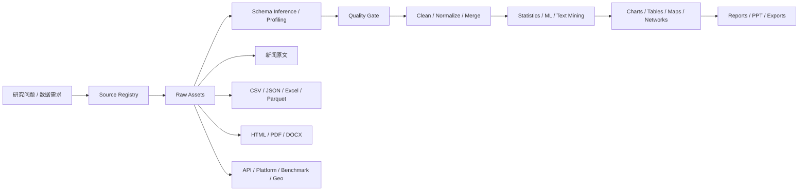

# PolitiStream 数据处理、统计分析、可视化与 AI 制图升级方案

更新时间：2026-06-07
定位：把现有“强力抓取 + 深度研究”继续向下延伸，升级成一套能处理新闻、结构化数据、比赛数据、平台数据、PDF 表格和网页表格的研究型数据工厂。

## 1. 结论先行

这次升级不建议做成“另一个通用 BI”，而是做成“研究导向的数据处理工作台”：

```text
多源抓取 / 导入
  -> 新闻整理 / 分类 / 去重 / 筛选
  -> 数据画像 / 质量校验 / 清洗
  -> 统计分析 / 建模 / 机器学习 / 深度学习
  -> 论文图 / 工程图 / 统计图 / 交互图
  -> 可复现报告 / PPT / 导出资产 / 证据链
```

目标是：

- 对新闻原文能做整理、分类、筛选、时间线、实体图和来源质量分析。
- 对结构化数据能做清洗、聚合、回归、聚类、时间序列、异常检测。
- 对图表能同时支持论文级静态图、工程图、交互图、地图、关系网络图。
- 对报告能输出 Markdown、DOCX、PDF、PPTX，且所有结果都能回溯到数据资产和代码。
- AI 负责规划、解释、摘要和图表建议，事实计算必须由确定性引擎完成。

## 2. 当前仓库事实

仓库已经不是空白状态，下面这些实现是这次方案的起点：

- `src/server/analytics/engine.ts` 已经有数据画像、描述统计和图表建议能力。
- `src/server/analytics/routes.ts` 已经暴露了 `/api/analytics/profile`、`/api/analytics/statistics/descriptive`、`/api/analytics/visualizations/render` 等接口。
- `src/server/analytics/visualization.ts` 已经能生成 bar / line / scatter / histogram / table 一类的可复现图表资产。
- `workers-analytics/` 已经是独立的 Python 分析 lane，`workers-analytics/pyproject.toml` 里也把 DuckDB、Pandas、Polars、NumPy、SciPy、statsmodels、scikit-learn、Matplotlib、Seaborn、Plotly 放进来了。
- `src/components/DataLab.tsx` 和 `src/components/AgentConsole.tsx` 已经在前端暴露数据画像、统计分析、图表建议和自然语言入口。
- `README.md` 已经把系统定位成“新闻抓取、RSS 监控和深度研究项目”，并说明了 React/Vite、Express、SQLite、Postgres、Redis/BullMQ 的基本架构。

所以这次不是从零做分析系统，而是把现有雏形补成研究级数据工作台。

## 3. 方案比较

### 方案 A：Python Worker + 自定义前端工作台

推荐方案。Node 只负责 API、任务编排和资产管理，重计算全部下沉到 Python worker。

优点：

- 和现在的 `workers-analytics` 最贴合。
- 适合 DuckDB / Polars / Pandas / SciPy / statsmodels / scikit-learn / PyTorch 这种组合。
- 图表、报告、统计、模型都能统一做成可复现资产。

缺点：

- 需要自己补分析 UI 和任务模型。

### 方案 B：Notebook / Quarto 优先

把分析重心放在 notebook 和 Quarto 文档上。

优点：

- 研究人员上手快。
- 报告输出自然。

缺点：

- UI 入口弱。
- 产品化和任务化不好做。

### 方案 C：直接接入完整 BI / 分析平台

例如 Superset、Metabase、JupyterHub 一类。

优点：

- 快速得到成熟图表和查询界面。

缺点：

- 和当前研究型爬虫工作流不够贴合。
- 证据链、来源链和 AI 规划不容易统一。

结论：先做方案 A，必要时再借用 B 和 C 的产物。

## 4. 目标能力分层

### 4.1 新闻与研究文本

新闻不是“抓下来就完了”，要有完整整理链路：

| 能力 | 输出 |
|---|---|
| 去重与聚类 | 同题新闻聚合、canonical story |
| 来源分类 | 官方、主流媒体、行业媒体、博客、论坛、数据源 |
| 主题分类 | 政策、市场、科技、产业、公司、地缘、安全、体育 |
| 实体抽取 | 人物、机构、公司、地点、产品、法案、比赛、指标 |
| 时间线 | 首发、更新、转载、引用链 |
| 相关性筛选 | 与研究课题的匹配度、证据价值 |
| 证据抽取 | claim、quote、paraphrase、supports、contradicts |
| 冲突检测 | 不同来源对同一事实的冲突说法 |
| 摘要生成 | 默认简体中文，原文内容保留原语言 |

### 4.2 结构化数据

对 CSV、JSON、JSONL、Parquet、Excel、HTML 表格、PDF 表格、GeoJSON、API 数据，都要能统一处理：

- Schema 推断。
- 缺失值、异常值、重复值处理。
- 类型转换和单位换算。
- join、groupby、pivot、滚动统计。
- 时间序列趋势、同比、环比、异常点。
- 地理空间聚合、地图和热力图。
- 原始快照、清洗版本和 lineage 保存。

### 4.3 统计分析

目标是常见统计工作流对齐 SPSS / JASP / jamovi / PSPP，同时保留可编程和可复现能力：

- 描述统计。
- 频数表和交叉表。
- 相关分析。
- t 检验、卡方、ANOVA、非参数检验。
- 线性回归、逻辑回归、泊松回归。
- PCA / 因子分析 / 聚类分析。
- 时间序列分析。
- 异常检测。
- 文本 embedding 聚类。
- 模型解释和特征贡献分析。

### 4.4 制图与可视化

图表层要覆盖四种场景：

- 统计图：箱线图、散点图、直方图、热力图、相关矩阵、趋势图。
- 论文图：高分辨率静态图、可导出 SVG / PDF。
- 工程图：流程图、结构图、网络图、系统架构图。
- 交互图：网页图、筛选图、地图、可下钻图表。

### 4.5 AI 与人机协作

AI 只做这几件事：

- 根据问题推荐分析路线。
- 生成可复现的 Python / SQL / 图表代码骨架。
- 帮忙解释结果、摘要结论、生成中文报告。
- 帮忙检查图表是否误导、标题是否合理、单位是否缺失。

AI 不做这些事：

- 不伪造统计结果。
- 不把生成图当事实图。
- 不代替实际统计计算。
- 不绕过数据来源的权限和边界。

## 5. 推荐技术栈

### 5.1 数据底座

| 技术 | 角色 | 适合的位置 |
|---|---|---|
| DuckDB | 本地 OLAP / 直接查文件 | CSV / JSON / Parquet / 表格快照 |
| Polars | 高性能 DataFrame | 大表处理、懒执行、流式转换 |
| Pandas | 兼容性最强 | 传统分析、导出、生态适配 |
| NumPy | 数值计算底座 | 数组、矩阵、基础数学 |
| PyArrow | 交换底座 | Python / 存储 / 列式数据传输 |

### 5.2 质量与自动 EDA

| 技术 | 角色 |
|---|---|
| Great Expectations | 数据质量规则、验证报告 |
| Pandera | DataFrame schema 和运行时约束 |
| YData Profiling | 自动 EDA 报告 |
| Evidently | 数据漂移和长期监控 |

推荐组合是：

- `Pandera` 做代码级 schema 约束。
- `Great Expectations` 做可读性更强的质量门。
- `YData Profiling` 做快速自动 EDA。
- `Evidently` 做持续数据观察和 drift 监控。

### 5.3 统计、机器学习、深度学习

| 技术 | 角色 |
|---|---|
| SciPy | 统计检验、分布、优化 |
| statsmodels | 回归、ANOVA、时间序列 |
| scikit-learn | 分类、聚类、降维、模型选择 |
| PyTorch | 深度学习、embedding、复杂建模 |
| SHAP | 模型解释 |
| transformers / sentence-transformers | 文本分类、语义表示 |

### 5.4 制图与可视化

| 技术 | 角色 |
|---|---|
| Matplotlib | 论文级静态图 |
| Seaborn | 统计关系图、分布图 |
| Plotly | 交互图、网页图、地图 |
| Altair / Vega-Lite | 声明式统计图 |
| ECharts | 前端业务图和仪表盘图 |
| Graphviz | 关系图、流程图、系统图 |
| NetworkX | 网络分析和图数据准备 |
| GeoPandas / Folium | 地理数据和地图 |
| PyVista | 3D 可视化和工程感图形 |
| Schemdraw | 电路、流程和工程草图 |

### 5.5 报告与导出

| 技术 | 角色 |
|---|---|
| Jupyter | 交互式分析 |
| Quarto | 可复现报告、HTML / PDF / DOCX / PPTX |
| Pandoc | Markdown 和文档转换 |
| LibreOffice | DOCX / PDF 导出 |
| python-pptx | PPTX 生成 |

### 5.6 Codex 本地技能补位

这些不是运行时依赖，而是人工/半自动交付层的补充：

- `spreadsheets`：表格检查、预览、对账、快速图表。
- `documents` / `docx`：报告审阅、Word 交付稿。
- `presentations`：汇报 PPT 生成。
- `imagegen` / `canvas-design`：封面、概念图、非事实型示意图。

原则很简单：

- 事实图表必须由数据代码生成。
- AI 图片只能做封面、概念图、示意背景。

## 6. 推荐架构



### 6.1 Node 侧

Node / Express 负责：

- 接 API。
- 管理数据资产元信息。
- 调度任务。
- 维护 job 状态和运行日志。
- 把结果写回 Postgres。

### 6.2 Python 侧

Python worker lane 负责：

- 数据画像。
- 统计分析。
- 机器学习。
- 图表渲染。
- 报告生成。
- 地理和网络分析。

### 6.3 前端侧

Data Lab 建议按这个顺序展开：

- 数据集导入。
- 数据画像。
- 数据清洗。
- 统计分析。
- 图表建议。
- 图表渲染。
- 报告生成。
- 导出与追溯。

## 7. 数据类型适配策略

### 7.1 新闻和文本

适合做：

- 去重。
- 主题聚类。
- 来源质量打分。
- 事件时间线。
- 实体和 claim 图谱。
- 冲突检测。

### 7.2 统计表和业务表

适合做：

- 描述统计。
- 分组对比。
- 透视表。
- 回归分析。
- 趋势分析。
- 质量门。

### 7.3 比赛 / 赛事 / 平台数据

适合做：

- 排名和积分趋势。
- 赛程时间线。
- 平台活跃度。
- 版本和 license 追踪。
- 下载量 / stars / issue 活跃度分析。

### 7.4 地理空间数据

适合做：

- 区域分布。
- 热力图。
- 行政区聚合。
- 迁移 / 流向图。

### 7.5 PDF / HTML 表格

适合做：

- 表格抽取。
- 表格规范化。
- 财报 / 监管 / 年报解析。
- 论文附表处理。

## 8. 实施优先级

### Phase 1：把现有能力补齐成稳定底座

- 统一 dataset asset、profile、job、artifact 的数据模型。
- 让 Python worker 先稳定支持 profile 和 descriptive stats。
- 让前端 Data Lab 可以直接看见资产、图表建议和执行结果。

### Phase 2：补上数据处理和质量门

- 增加 schema 推断。
- 增加 quality report。
- 增加清洗 recipe。
- 支持 CSV / JSON / Excel / Parquet / HTML 表格 / PDF 表格。

### Phase 3：补上统计分析和建模

- t 检验、卡方、ANOVA、回归。
- 聚类、降维、异常值检测。
- 文本 embedding 聚类。
- SHAP / 解释报告。

### Phase 4：补上制图和报告

- 静态图 / 交互图 / 地图 / 网络图 / 工程图。
- Quarto 报告。
- DOCX / PDF / PPTX 导出。
- 中文默认报告和双语 UI 切换。

### Phase 5：补上 AI 协作层

- 自然语言分析指令。
- 图表建议和图表审稿。
- 报告摘要和结论生成。
- 研究问题到分析流程的自动规划。

## 9. 验收标准

1. 传入一组新闻、表格或研究数据后，系统能自动生成数据画像和质量提示。
2. 系统能对同一数据集做描述统计、相关分析、分组统计和基本回归。
3. 系统能把同一数据渲染成至少一种静态图和一种交互图。
4. 系统能导出可复现的分析结果和图表资产。
5. 系统能对新闻原文做分类、聚类、实体抽取和时间线整理。
6. 中文摘要和报告默认输出简体中文，原文内容保留原语言。
7. 大计算不在 Node API 进程里执行，而是下沉到 worker lane。
8. 所有分析结果都能追溯到数据源、过滤条件和运行记录。

## 10. 风险与边界

- 不把 AI 生成图片当成事实图。
- 不把没有校验的数据直接当结论。
- 不在 Node 里做重计算。
- 不混用系统 Python / Homebrew Python / 项目环境。
- 不把前端一次性塞成完整 BI，先把研究链路做顺。
- 不做登录绕过、验证码绕过、付费墙绕过。

## 11. 参考资料

以下是本方案调研时参考的官方文档方向：

- DuckDB: <https://duckdb.org/docs/stable/>
- Polars: <https://docs.pola.rs/>
- Pandas: <https://pandas.pydata.org/docs/>
- SciPy: <https://docs.scipy.org/doc/scipy/>
- statsmodels: <https://www.statsmodels.org/stable/>
- scikit-learn: <https://scikit-learn.org/stable/>
- PyTorch: <https://pytorch.org/docs/stable/index.html>
- Great Expectations: <https://docs.greatexpectations.io/>
- Pandera: <https://pandera.readthedocs.io/>
- Matplotlib: <https://matplotlib.org/stable/>
- Seaborn: <https://seaborn.pydata.org/>
- Plotly: <https://plotly.com/python/>
- Altair: <https://altair-viz.github.io/>
- Apache ECharts: <https://echarts.apache.org/>
- Quarto: <https://quarto.org/>
- Jupyter: <https://jupyter.org/>

这份文档可以作为后续拆任务、写 OpenSpec、或者继续分解成实现计划的总蓝图。
