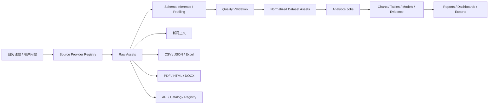

# PolitiStream 数据处理、统计分析、可视化与数据源深化方案

更新时间：2026-06-07

## 1. 结论先行

PolitiStream 后续不能只停留在“把数据抓下来”。真正能支撑深度研究的系统，应该把数据处理能力做成一条完整链路：

```text
多源抓取
  -> 新闻整理 / 分类 / 去重 / 筛选
  -> 结构化清洗 / schema 推断 / 质量校验
  -> 统计分析 / 建模 / 机器学习 / 深度学习
  -> 论文图 / 工程图 / 交互图 / 地图 / 网络图
  -> 可复现报告 / PPT / 导出资产 / 证据链
```

这套能力的目标不是“再做一个 SPSS”，而是做到：

- 比 SPSS 更强的可编程性和可复现性。
- 比传统 BI 更强的研究工作流和证据链。
- 比单纯 Python Notebook 更强的产品化入口和资产管理。
- 对新闻、比赛数据、开放数据、平台数据、地理数据都能统一处理。
- AI 负责计划、解释和包装，事实计算由确定性引擎完成。

## 2. 当前仓库事实

当前仓库已经有了可继续扩展的基础，不是从零开始：

- `README.md` 已经把系统定位成“新闻抓取、RSS 监控和深度研究项目”，并明确提到前端 Vite + React、后端 Express、SQLite 新闻库、Postgres 深度研究库、Redis/BullMQ worker、以及 `workers-analytics` Python 分析 lane。
- `src/components/DataLab.tsx` 已经提供数据集保存、画像、描述统计、worker 任务、图表建议和图表资产渲染入口。
- `src/server/analytics/engine.ts` 已经有能力注册表，包含新闻整理、数据画像、SPSS 级统计、PyTorch/ML、可视化、可复现报告等方向。
- `src/server/analytics/jobs.ts` 和 `src/server/analytics/workerRunner.ts` 已经把分析任务接到 Python worker lane。
- `workers-analytics/README.md` 和 `workers-analytics/politistream_analytics/worker.py` 说明当前 Python CLI 仍然很轻，只做 `profile` 和 `stats`。
- `src/server/analytics/visualization.ts` 目前能产出 bar/line/scatter/histogram/table 一类资产，其他图形还主要停留在 spec 层。
- `src/components/AgentConsole.tsx` 已经支持把自然语言需求和 JSON 数据行一起分派给系统。

所以这次升级不是“新增一个分析功能”，而是把已有雏形升级为可持续的研究数据工厂。

## 3. 目标定义

### 3.1 新闻处理目标

对新闻原文和研究文本，系统要能自动完成：

- 去重与故事聚类。
- 来源分类与来源层级识别。
- 主题标签、实体抽取、时间线整理。
- 相关性筛选和证据抽取。
- 冲突信息识别与事实核验辅助。
- 原文语言保留，AI 摘要和报告默认简体中文。

### 3.2 通用数据处理目标

对结构化和半结构化数据，系统要能完成：

- schema 推断、字段类型识别、单位识别。
- 缺失值、异常值、重复值、口径冲突处理。
- join、groupby、pivot、窗口统计、时间序列处理。
- 地理数据、比赛数据、平台数据、研究数据的统一预览和分析。
- 原始快照、清洗版本、转换 lineage 的留存。

### 3.3 分析与制图目标

系统要能达到或超过 SPSS Pro 常见能力，同时补上它通常不擅长的部分：

| 维度 | 传统 SPSS | PolitiStream 目标 |
|---|---|---|
| 入口 | 以 GUI 为主 | GUI + API + worker + 可复现脚本 |
| 数据规模 | 中小规模更顺手 | DuckDB/Polars 支持更大表和文件 |
| 数据源 | 主要是导入文件 | 新闻、开放数据、平台 API、比赛数据、研究数据 |
| 分析范围 | 常见统计为主 | 统计 + ML + 深度学习 + 证据图 |
| 可视化 | 常规统计图 | 论文图、工程图、网络图、地图、交互图 |
| 复现性 | 一般 | 结果、代码、资产、lineage 全保留 |
| AI 协助 | 有限 | 规划、解释、冲突检查、报告生成 |

## 4. 总体架构

建议把“数据抓取”和“数据处理”之间加一层统一的数据资产模型：



核心原则：

1. 原始内容先保留，再清洗。
2. 先结构化，再统计，再制图，再写报告。
3. AI 只做规划、解释、冲突检查和报告草拟，不直接替代事实计算。
4. 研究过程中的每一步都要能回放。

## 5. 数据处理能力矩阵

### 5.1 新闻与研究文本

这一层面向 RSS、新闻正文、研究文档、政策文本、比赛公告、工具评测等内容。

| 能力 | 输出 |
|---|---|
| 去重 | 相似文章聚类、canonical story |
| 分类 | 来源类型、主题标签、可信层级 |
| 实体抽取 | 人物、机构、公司、产品、地点、赛事、指标 |
| 时间线 | 事件演化、发布顺序、引用顺序 |
| 相关性筛选 | 与研究课题的匹配度、证据价值 |
| 证据抽取 | claim / quote / paraphrase / supports / contradicts |
| 冲突检测 | 不同来源的矛盾说法与缺口 |
| 摘要生成 | 默认简体中文，但保留原文语言 |

### 5.2 结构化数据

这一层面向 CSV、JSON、JSONL、Parquet、Excel、GeoJSON、API 返回、研究 run 导出的表格。

| 能力 | 输出 |
|---|---|
| Schema 推断 | 字段类型、候选主键、时间字段 |
| 数据画像 | 行数、列数、缺失率、唯一值、分布、异常值 |
| 清洗转换 | 类型转换、日期解析、单位换算、列名标准化 |
| Join / 聚合 | 多表关联、透视表、滚动统计 |
| 时间序列 | 趋势、同比、环比、异常点、季节性 |
| 地理空间 | 位置映射、热力图、区域汇总 |
| 数据版本 | 原始快照、清洗版本、变更 lineage |

### 5.3 比赛 / 竞赛 / 评测数据

这里的“比赛”不仅是体育，也包括 Kaggle、榜单、benchmark、产品对比和评测任务。

| 场景 | 关键字段 |
|---|---|
| Kaggle / 竞赛 | 规则、数据文件、评价指标、提交样例、截止时间 |
| ML benchmark | task、metric、split、score、model card |
| 体育赛事 | 赛程、球队、球员、事件流、积分榜 |
| 工具评测 | 版本、license、下载量、维护频率、benchmark 结果 |
| 政策 / 金融研究 | 指标、时间序列、监管披露、公告时间线 |

## 6. 推荐技术栈

### 6.1 核心数据引擎

建议保留并强化以下组合：

- `DuckDB`：本地 OLAP、直接查询 CSV/JSON/Parquet/数据库文件，适合把文件放在原处就能分析。
- `Polars`：高性能 DataFrame，适合大表、懒执行、流式处理。
- `Pandas`：兼容性最好，生态最广，适合通用数据操作。
- `PyArrow`：跨 Python / Node / 存储层的数据交换底座。

### 6.2 质量与自动 EDA

- `Great Expectations`：Expectation 驱动的质量校验和 Validation 结果。
- `Pandera`：DataFrame schema 和运行时约束。
- `YData Profiling`：自动 EDA 报告。
- `Evidently`：数据漂移、参考集 / 当前集对比、长期监控。

### 6.3 统计、机器学习、深度学习

- `SciPy`：统计检验、优化、分布函数。
- `statsmodels`：回归、方差分析、时间序列。
- `scikit-learn`：分类、聚类、降维、特征工程。
- `PyTorch`：深度学习、embedding、文本/多模态模型。
- `transformers` / `sentence-transformers`：文本分类、语义表示、主题聚类。
- `SHAP`：模型解释和特征贡献分析。

### 6.4 制图与可视化

- `Matplotlib`：论文级静态图。
- `Seaborn`：统计关系图、分布图、回归图。
- `Plotly`：交互式图、网页图、地图、时间序列。
- `Altair`：声明式统计可视化。
- `ECharts`：前端仪表盘图和业务图。
- `Graphviz` / `Mermaid`：关系图、流程图、架构图。

### 6.5 报告与导出

- `Jupyter`：交互式分析。
- `Quarto`：把 Python/R/Markdown 组合成可复现报告、HTML、PDF、Word、PPT。
- `Pandoc`：Markdown / DOCX / PDF 转换。
- `LibreOffice`：DOCX -> PDF 自动化导出。
- `python-pptx`：结构化生成 PPTX。

### 6.6 Codex 工具层的辅助能力

这些工具不负责事实计算，只负责包装和交付：

- `documents` / `docx`：报告编辑和审阅。
- `spreadsheets`：表格检查、数据预览、对账。
- `presentations`：汇报 PPT。
- `canvas-design` / `imagegen`：封面、概念图、信息图。

## 7. 数据源接入层

要把数据处理真正做强，必须把“数据源”做成统一 provider registry，而不是只有网页抓取。

### 7.1 数据源类别

| 类别 | 代表来源 | 适合抓取什么 |
|---|---|---|
| 开放数据目录 | CKAN、Socrata、ArcGIS Hub、World Bank Data Catalog | 政府数据、公共数据、地理空间数据 |
| 科研知识图谱 | OpenAlex、Crossref、Hugging Face Datasets | 论文、作者、机构、数据集、模型卡 |
| 监管 / 金融 | SEC EDGAR、交易所公告、公开披露 | 财报、公告、XBRL、监管事实 |
| 平台生态 | GitHub、npm、PyPI | 项目活跃度、版本、license、依赖 |
| 比赛 / 赛事 | Kaggle、OpenF1、体育公开 API | 竞赛、赛事、事件流、榜单 |
| 新闻 / 舆情 | RSS、GDELT、新闻搜索 provider | 新闻、事件、舆情、时间线 |
| 地理 / 环境 | ArcGIS、World Bank、气象/空气质量 API | 地图、空间数据、环境指标 |

### 7.2 Provider 设计原则

每个 provider 都应输出统一的 `DiscoveredCandidate` 或 `DatasetCandidate`，并记录：

- source type。
- authority tier。
- freshness。
- license / terms。
- coverage。
- file format。
- access mode。
- cost / rate limit。

### 7.3 访问策略

必须严格遵守以下边界：

- 公开内容优先。
- 官方 API 优先。
- 需要 key 的服务走合法 key。
- 需要授权的数据只处理用户已经有权访问的内容。
- 不做登录绕过、验证码绕过、付费墙绕过、访问控制绕过。

## 8. 数据处理流水线

建议把分析流程固定成以下顺序：

1. 发现数据源。
2. 拉取原始资产。
3. 推断 schema。
4. 画像和质量校验。
5. 清洗、标准化、合并。
6. 统计分析或建模。
7. 生成图表。
8. 生成报告。
9. 保存资产和 lineage。

对大数据集，优先走：

- `DuckDB` 做 SQL 预处理。
- `Polars` 做高性能列式处理。
- `Pandas` 只做兼容和最后一公里。

对文本数据，优先走：

- 规则和统计先做分类、去重、切片。
- LLM 负责摘要、主题归纳、证据归纳。
- 结果落成结构化表，而不是只留一段自然语言。

## 9. 可视化策略

### 9.1 图表分层

| 图类型 | 推荐引擎 | 场景 |
|---|---|---|
| 论文静态图 | Matplotlib / Seaborn | 统计图、分布图、散点图、回归图 |
| 交互式图 | Plotly / ECharts | 前端查看、筛选、悬浮说明 |
| 网络图 | Graphviz / network layout | 来源关系、实体关系、证据图 |
| 地图 | Plotly / ECharts / GeoPandas | 区域分析、空间分布 |
| 工程图 | Matplotlib / Graphviz / Mermaid | 结构图、流程图、系统图 |
| 信息图 | Canvas-design / imagegen / presentations | 汇报封面、概念图、视觉包装 |

### 9.2 AI 参与边界

AI 可以：

- 生成图表说明文字。
- 建议图表类型。
- 帮忙检查标题、坐标轴、单位、颜色、注释。
- 生成封面或概念配图。

AI 不应该：

- 伪造统计结果。
- 伪造数据图。
- 把没有证据的数据“画得很像真的”。

## 10. 当前实现的升级建议

### 10.1 先补强现有 Data Lab

第一阶段最值得做的，是把现有 `Data Lab` 从“轻量画像”升级成“真正的数据工作台”：

- 支持数据集来源区分：manual / upload / research-run / crawler / api。
- 支持更多导入类型：CSV、JSONL、Parquet、Excel、GeoJSON。
- 支持更完整的质量报告：缺失值、异常值、重复值、schema drift。
- 支持更丰富的图表建议：箱线图、热力图、时间线、网络图、地图。
- 支持结果导出：JSON、PNG、SVG、PDF、DOCX、PPTX。

### 10.2 再补强 Python worker

`workers-analytics` 当前只做 `profile` 和 `stats`，下一步应该加入：

- `validate`：Great Expectations / Pandera 校验。
- `clean`：标准化和缺失处理。
- `segment`：分类、聚类、分组。
- `trend`：时间序列与窗口统计。
- `model`：回归、分类、聚类、特征分析。
- `viz`：图表 spec + 渲染。
- `report`：Quarto / Jupyter / Pandoc 输出。

### 10.3 再补强数据源层

把所有可抓取数据都抽成统一 registry：

- 新闻源。
- 开放数据目录。
- 科研数据。
- 平台数据。
- 比赛数据。
- 地理 / 环境数据。
- 监管 / 金融数据。

这样后续“我想查一个课题”时，系统才能先判断应当去哪里找，而不是只会搜网页。

## 11. 分阶段落地路线

### Phase 1：把现有能力做厚

- 强化 `Data Lab` 的数据集管理和导入。
- 补齐更完整的 profile 和 descriptive stats。
- 接上 validation 和质量报告。
- 明确 raw content 与 analysis asset 的关系。

### Phase 2：把分析做成标准任务

- 增加统计检验、回归、聚类、分类、时间序列任务。
- 让每个任务都产出 job + artifact。
- 建立统一的可复现代码片段。

### Phase 3：把制图和报告产品化

- 把图表建议变成可导出的资产。
- 接入 Quarto / Jupyter / Pandoc / LibreOffice。
- 支持 Markdown、DOCX、PDF、PPTX。

### Phase 4：把数据源接入做广

- 加入 CKAN / Socrata / ArcGIS / World Bank / OpenAlex / SEC / GDELT / Kaggle / Hugging Face 等 provider。
- 建立数据源可信度和 license 评分。
- 把比赛数据和平台数据纳入同一体系。

### Phase 5：加 AI 辅助，但不让 AI 代替事实

- AI 负责分析计划、摘要、冲突检查、报告语言润色。
- 事实计算始终由确定性引擎产出。
- AI 只能围绕已验证结果写解释。

## 12. 风险与约束

- 不做登录绕过、验证码绕过、付费墙绕过。
- 不把 AI 生成图当作事实图。
- 不把原始内容强行翻译成统一语言；原文保持原语言。
- AI 摘要和最终报告默认简体中文。
- 大数据必须用 DuckDB / Polars，不能无脑把全量数据塞进前端。
- Python 分析环境必须独立管理，避免和系统 Python / Homebrew Python 混用。

## 13. 参考调研

以下是一手资料和官方文档，作为本方案的主要技术依据：

- [DuckDB](https://duckdb.org/)
- [Polars Lazy API](https://docs.pola.rs/user-guide/lazy/)
- [Great Expectations](https://docs.greatexpectations.io/)
- [Pandera](https://pandera.readthedocs.io/)
- [Evidently](https://docs.evidentlyai.com/)
- [Plotly Documentation](https://plotly.com/python/)
- [Quarto](https://quarto.org/)
- [OpenAlex](https://docs.openalex.org/)
- [Hugging Face Datasets](https://huggingface.co/docs/datasets)
- [SEC EDGAR APIs](https://www.sec.gov/search-filings/edgar-application-programming-interfaces)
- [World Bank Indicators API](https://datahelpdesk.worldbank.org/knowledgebase/articles/889392)
- [CKAN API](https://docs.ckan.org/en/2.9/api/index.html)
- [Socrata SODA API](https://dev.socrata.com/docs/endpoints)
- [ArcGIS REST APIs](https://developers.arcgis.com/documentation/glossary/arcgis-rest-apis/)
- [OpenF1](https://openf1.org/docs/)
- [GDELT Event / GKG Documentation](https://data.gdeltproject.org/documentation/)

如果要继续往下落实现，建议下一份文档直接进入“数据源 provider registry + 数据资产模型 + worker 任务定义”三级拆解。
