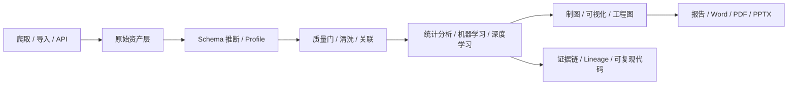

# PolitiStream 数据处理、统计分析、可视化与论文发布能力完整方案

更新时间：2026-06-07
定位：在现有 `Research run + Data Lab` 基础上，补齐“新闻整理、结构化数据处理、统计建模、论文级制图、工程制图、报告发布、AI 辅助”的完整数据能力层。目标不是做成传统 BI，而是做成研究导向的数据工作台。

## 1. 结论先行

PolitiStream 后续的数据能力应该做到：

```text
爬取 / 导入
  -> 新闻整理 / 分类 / 去重 / 筛选
  -> 数据画像 / 质量校验 / 清洗 / 关联
  -> 统计分析 / 机器学习 / 深度学习
  -> 论文图 / 工程图 / 统计图 / 交互图
  -> 可复现报告 / Word / PDF / PPTX / 证据链
```

核心判断：

1. `SPSS Pro` 级别的 GUI 体验要有，但不能止步于 GUI。
2. 要同时保留 `Python / SQL / R` 级别的可复现分析能力。
3. 事实图表必须由真实数据和代码生成，AI 只负责规划、解释和辅助。
4. 新闻原文和数据原文保留其原始语言，AI 摘要和研究报告默认简体中文。
5. 结构化数据源不能只限于新闻，还要覆盖比赛数据、平台数据、政府开放数据、学术数据、金融数据和地理数据。

## 2. 当前仓库事实

这不是从零开始，仓库里已经有一条可用的基础链路：

- `README.md:257-271` 已经暴露了 analytics profile、statistics、visualizations、datasets、artifacts 等接口。
- `src/server/analytics/engine.ts:10-66` 已经定义了 `news-processing`、`data-profiling`、`statistics`、`machine-learning`、`visualization`、`reporting` 六类能力。
- `src/server/analytics/routes.ts:21-179` 已经提供了 `/api/analytics/profile`、`/api/analytics/datasets`、`/api/analytics/datasets/:id/analyze`、`/api/analytics/visualizations/render`、`/api/analytics/statistics/descriptive` 等入口。
- `src/server/analytics/jobs.ts:12-124` 已经把 profile / descriptive-statistics / visualization-render 送去 Python worker 并保存 artifact。
- `workers-analytics/pyproject.toml:6-46` 已经准备了 DuckDB、Pandas、Polars、PyArrow、NumPy、SciPy、statsmodels、scikit-learn、Matplotlib、Seaborn、Plotly，以及可选的 PyTorch、Pandera、Great Expectations、Evidently、GeoPandas、Jupyter、nbconvert、python-pptx。
- `src/components/DataLab.tsx:112-260` 已经有 Data Lab 前端入口，可做数据集保存、画像、统计、图表建议、Worker 分析。
- `src/server/research/types.ts:1-13` 和 `src/server/research/queryPlanner.ts:266-275` 已经把 dataset discovery、structured API、competition data、sports data、visualization 作为研究任务的一等公民。

所以这次要做的不是“再加一个图表页”，而是把现有雏形补成一套完整的数据研究台。

## 3. 能力目标

### 3.1 新闻处理

新闻不只是“抓到就存”：

- 去重、聚类、同题合并。
- 来源分层、可信度评分、转载链识别。
- 主题分类、标签抽取、实体抽取。
- 时间线整理、更新链、冲突说法对照。
- 支持原文多语言展示，AI 摘要默认简体中文。

### 3.2 结构化数据处理

支持把爬到的数据变成可分析对象：

- CSV / TSV / JSON / JSONL / Parquet / Excel / HTML 表格 / PDF 表格 / GeoJSON / SDMX / XBRL。
- Schema 推断、字段类型识别、单位识别、缺失值、重复值、异常值。
- join、groupby、pivot、滚动统计、时间序列、地理空间分析。
- 原始快照、清洗版本、分析版本、lineage 全部保留。

### 3.3 统计分析与建模

目标至少覆盖：

- 描述统计、频数表、交叉表。
- 相关分析、t 检验、卡方、ANOVA、非参数检验。
- 线性回归、逻辑回归、GLM、时间序列。
- PCA、因子分析、聚类分析、异常检测。
- 文本 embedding、主题聚类、分类、解释性分析。

### 3.4 制图与可视化

要能同时满足三类图：

- 论文图：高分辨率静态图、SVG、PDF。
- 工程图：流程图、结构图、网络图、系统图。
- 交互图：网页图、筛选图、地图、可下钻图表。

### 3.5 报告与发布

最终输出应包括：

- Markdown
- DOCX
- PDF
- PPTX
- 可复现代码片段
- 证据链 / 数据来源 / 口径说明

### 3.6 AI 与 Skill 辅助

AI 适合做：

- 分析路线规划
- 变量和图表建议
- 代码骨架生成
- 报告文字解释
- 图表标题、单位、口径检查

AI 不应该做：

- 伪造统计结果
- 伪造事实图表
- 直接替代确定性计算

Codex skills 适合做交付补位：

- `spreadsheets`：表格检查、图表和数据核对
- `documents` / `docx`：Word 交付稿
- `presentations`：汇报 PPT
- `imagegen` / `canvas-design`：封面、概念图、示意图

## 4. 推荐技术栈

### 4.1 数据底座

| 层级 | 推荐技术 | 作用 |
|---|---|---|
| 查询与文件分析 | DuckDB | 直接查 CSV / JSON / Parquet / Arrow，适合嵌入式 OLAP |
| 高性能 DataFrame | Polars | 大表、懒执行、流式处理 |
| 兼容性分析 | Pandas | 最广泛的数据处理生态 |
| 数值计算 | NumPy | 基础数学、矩阵、数组 |
| 列式交换 | PyArrow | Python / 存储 / 分析之间的列式通道 |

### 4.2 质量与画像

| 层级 | 推荐技术 | 作用 |
|---|---|---|
| Schema 校验 | Pandera | 字段类型、范围、必填、结构约束 |
| 数据质量规则 | Great Expectations | 可读的质量门和验证报告 |
| 自动画像 | YData Profiling | 快速 EDA、缺失概览、分布和相关性 |
| 漂移监控 | Evidently | 数据漂移、长期监控、回归检查 |

### 4.3 统计、机器学习、深度学习

| 层级 | 推荐技术 | 作用 |
|---|---|---|
| 统计检验 | SciPy | 显著性检验、分布和优化 |
| 统计建模 | statsmodels | 回归、ANOVA、时间序列 |
| 传统机器学习 | scikit-learn | 分类、聚类、降维、模型选择 |
| 深度学习 | PyTorch | 文本、表格、embedding、复杂模型 |
| 可解释性 | SHAP | 特征贡献、模型解释 |

### 4.4 制图与可视化

| 场景 | 推荐技术 | 适合输出 |
|---|---|---|
| 论文静态图 | Matplotlib / Seaborn | PNG / SVG / PDF |
| 交互式图 | Plotly / ECharts | HTML / 可下钻页面 |
| 声明式图 | Altair / Vega-Lite | 轻量交互、可复现图 |
| 关系网络 | NetworkX / Graphviz | 实体图、证据图、系统图 |
| 地理空间 | GeoPandas / Folium | 区域图、热力图、点图 |
| 3D / 工程图 | PyVista / 其他几何工具 | 结构展示、工程示意 |

### 4.5 报告与导出

| 层级 | 推荐技术 | 作用 |
|---|---|---|
| 可复现文档 | Quarto | Markdown + Python/R，输出 HTML / PDF / DOCX |
| 交互分析 | Jupyter | 交互式探索、调试、复现实验 |
| 文档转换 | Pandoc | Markdown / DOCX / PDF 转换 |
| 终端导出 | LibreOffice | DOCX -> PDF |
| 演示文稿 | python-pptx | PPTX 自动生成 |

### 4.6 参考型 GUI 工具

这些不一定要直接嵌入运行时，但很适合作为交互参考：

- `SPSS`：低门槛统计分析向导。
- `jamovi`：点选分析 + 可复现语法。
- `JASP`：经典统计和结果展示体验。
- `PSPP`：开源 SPSS 替代参考。
- `Microsoft Data Formulator`：AI 辅助制图和数据变换的参考原型。

## 5. 数据源与处理策略

### 5.1 新闻和网页

- 先做 canonical URL、内容指纹、转载链识别。
- 再做 story clustering、主题分类、实体抽取、来源分层。
- 最后才进入摘要和报告。

### 5.2 结构化数据

优先支持：

- 政府开放数据 / 数据目录
- 比赛和竞赛数据
- 体育赛事数据
- 金融和宏观时间序列
- 平台生态数据（GitHub / npm / PyPI / Hugging Face）
- 学术和引用数据（OpenAlex / Crossref）

对这些数据，系统要回答的不只是“能不能抓到”，而是：

- 字段是什么
- 单位是什么
- 更新时间是什么
- 口径有没有变
- 许可证能不能用
- 能不能直接支撑研究问题

### 5.3 数据抓取后进入分析层的标准动作

```text
原始资产
  -> schema inference
  -> quality profile
  -> cleaning recipe
  -> statistics / ML / chart spec
  -> report / publication artifact
```

## 6. 推荐架构



### 6.1 任务分层

- Node 层：API、任务编排、资产管理、UI 入口。
- Python worker 层：重计算、统计、图表、质量检查、报告生成。
- 存储层：Postgres 元数据 + 对象资产 + DuckDB/Arrow 预览。
- 展示层：Data Lab、Research、Source Explorer、Report Viewer。

### 6.2 数据对象

- `dataset`：可分析数据集。
- `profile`：字段画像和质量评分。
- `analysis_job`：一次分析任务。
- `chart_artifact`：图表资产。
- `report_artifact`：报告资产。
- `lineage`：来源、转换、版本、引用链。

## 7. 建议的落地顺序

### P0

- 数据画像、质量门、描述统计。
- 新闻整理、分类、筛选。
- 基础图表：bar、line、scatter、histogram、table。
- Markdown / DOCX / PDF 基础报告。

### P1

- 交叉表、相关性、回归、聚类、时间序列。
- PDF 表格、Excel、GeoJSON、HTML 表格解析。
- Plotly 交互图、Graphviz 系统图、Quarto 报告。
- 数据集注册表、版本和 lineage。

### P2

- PyTorch 级深度分析、文本 embedding、主题聚类。
- 证据链和冲突检测联动。
- PPTX 自动汇报。
- AI 辅助图表建议和报告生成。
- 可选 R lane：`ggplot2` / `rmarkdown` / `tidyverse`，用于更强的出版风格输出。

## 8. 风险与边界

- 不把 AI 图片当作事实图表。
- 不让 AI 直接编造统计结论。
- 不在 Node API 进程里跑重型分析。
- 不混用系统 Python / Homebrew Python / conda / uv。
- 不把第一版做成纯 BI，也不把它做成封闭桌面软件。

## 9. 调研来源

以下是本方案参考的官方和研究资料：

- DuckDB 官方文档：<https://duckdb.org/docs/>
- Polars 官方文档：<https://docs.pola.rs/>
- pandas 官方文档：<https://pandas.pydata.org/docs/>
- SciPy 官方站点：<https://scipy.org/>
- statsmodels 官方文档：<https://www.statsmodels.org/stable/>
- scikit-learn 官方文档：<https://scikit-learn.org/stable/>
- PyTorch 官方文档：<https://pytorch.org/docs/stable/>
- Matplotlib 官方文档：<https://matplotlib.org/stable/>
- Seaborn 官方文档：<https://seaborn.pydata.org/>
- Plotly Python 官方文档：<https://plotly.com/python/>
- Quarto 官方文档：<https://quarto.org/docs/>
- Great Expectations 官方网站：<https://greatexpectations.io/>
- Pandera 官方文档：<https://pandera.readthedocs.io/>
- YData Profiling 官方文档：<https://docs.profiling.ydata.ai/>
- jamovi 官方网站：<https://www.jamovi.org/>
- JASP 官方网站：<https://jasp-stats.org/>
- PSPP 官方项目页：<https://www.gnu.org/software/pspp/>
- Microsoft Data Formulator 研究博客：<https://www.microsoft.com/en-us/research/blog/data-formulator-exploring-how-ai-can-help-analysts-create-rich-data-visualizations/>
