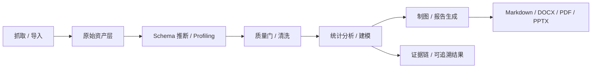

# PolitiStream 数据处理、统计分析与可视化 SPSS Pro+ 升级研究方案

更新时间：2026-06-07
定位：把现有“抓取 + 深度研究”继续向下延伸，升级成一套面向新闻、结构化数据、比赛数据、平台数据、PDF 表格和网页表格的研究型数据处理工作台。

## 1. 结论先行

这套能力不应该做成传统 BI，而应该做成“研究导向的数据工厂”：

```text
多源抓取 / 导入
  -> 新闻整理 / 分类 / 去重 / 筛选
  -> 数据画像 / 质量校验 / 清洗
  -> 统计分析 / 机器学习 / 深度学习
  -> 论文图 / 工程图 / 统计图 / 交互图
  -> 可复现报告 / PPT / Word / PDF / 证据链
```

工程上，它可以覆盖并在自动化、可复现性、批处理和证据链上超过 SPSS Pro 常见能力；SPSS 的强项是 GUI 体验，这套方案的强项是可编排、可扩展、可追溯。

## 2. 现状基线

仓库已经有一条可用的起点，不是从零开始：

- `src/server/analytics/engine.ts` 已经有数据画像、描述统计和图表建议。
- `src/server/analytics/routes.ts` 已经暴露 `/api/analytics/profile`、`/api/analytics/statistics/descriptive`、`/api/analytics/visualizations/render` 等接口。
- `workers-analytics/` 已经是独立 Python 分析 lane。
- `workers-analytics/pyproject.toml` 已经准备了 DuckDB、Pandas、Polars、NumPy、SciPy、statsmodels、scikit-learn、Matplotlib、Seaborn、Plotly。
- `src/components/DataLab.tsx` 已经有数据画像、统计、图表建议、Worker 结果和任务入口。
- `README.md` 已把系统定位成新闻抓取、RSS 监控和深度研究项目。

所以这次不是“再加一个图表页”，而是把现有雏形补成研究级数据工作台。

## 3. 目标能力

### 3.1 新闻整理

- 去重、聚类、同题合并。
- 来源分层、可信度评分、转载链识别。
- 主题分类、标签抽取、实体抽取。
- 时间线、更新链、冲突说法对照。
- 原文语言保留，AI 摘要默认简体中文。

### 3.2 数据处理

- CSV / JSON / JSONL / Parquet / Excel / HTML 表格 / PDF 表格统一处理。
- Schema 推断、缺失值、重复值、异常值、类型转换、单位换算。
- join、groupby、pivot、滚动统计、时间序列、地理数据。
- 原始快照、清洗版本、分析版本、lineage 保存。

### 3.3 统计分析

- 描述统计、频数表、交叉表。
- 相关分析、t 检验、卡方、ANOVA、非参数检验。
- 线性回归、逻辑回归、泊松回归。
- PCA、因子分析、聚类分析、异常检测。
- 文本 embedding 聚类、主题聚类、模型解释。

### 3.4 制图与可视化

- 统计图：箱线图、散点图、直方图、热力图、趋势图。
- 论文图：高分辨率静态图、SVG、PDF。
- 工程图：流程图、结构图、网络图、系统图。
- 交互图：网页图、筛选图、地图、可下钻图表。

### 3.5 AI 辅助

- 根据问题生成分析路线。
- 生成可复现的 Python / SQL / 图表代码骨架。
- 帮忙解释结果、摘要结论、生成中文报告。
- 帮忙检查图表标题、单位、口径和误导风险。

AI 不负责伪造统计结果，也不代替确定性计算。

## 4. 推荐技术栈

### 4.1 数据底座

| 技术 | 角色 | 适合场景 |
|---|---|---|
| DuckDB | 本地 OLAP / 直接查文件 | CSV、JSON、Parquet、快照查询 |
| Polars | 高性能 DataFrame | 大表处理、懒执行、流式转换 |
| Pandas | 兼容性最强 | 传统分析、导出、生态适配 |
| NumPy | 数值计算底座 | 数组、矩阵、基础数学 |
| PyArrow | 列式交换底座 | Python / 存储 / 列式传输 |

### 4.2 质量与画像

| 技术 | 角色 | 适合场景 |
|---|---|---|
| Pandera | DataFrame Schema 校验 | 结构约束、字段类型、必填规则 |
| Great Expectations | 数据质量规则 | 可读性强的质量门和测试报告 |
| YData Profiling | 自动 EDA | 快速画像、字段分布、缺失概览 |
| Evidently | 漂移监控与评估 | 持续监控、回归测试、质量趋势 |

### 4.3 统计、机器学习、深度学习

| 技术 | 角色 | 适合场景 |
|---|---|---|
| SciPy | 统计检验与优化 | 显著性检验、分布分析 |
| statsmodels | 统计建模 | 回归、ANOVA、时间序列 |
| scikit-learn | 机器学习 | 分类、聚类、降维、模型选择 |
| PyTorch | 深度学习 | embedding、文本分类、复杂模型 |
| SHAP | 模型解释 | 特征贡献、黑盒解释 |
| transformers | 语义建模 | 文本分类、摘要、向量化 |

### 4.4 制图与可视化

| 技术 | 角色 | 适合场景 |
|---|---|---|
| Matplotlib | 论文级静态图 | PDF / SVG / 高 DPI 图片 |
| Seaborn | 统计图 | 分布、关系、组间对比 |
| Plotly | 交互图 | 网页图、可探索图、地图 |
| Altair / Vega-Lite | 声明式统计图 | 可复现、轻量交互 |
| ECharts | 前端业务图 | 仪表盘、交互分析页 |
| Graphviz | 结构/流程图 | 系统图、架构图、关系图 |
| NetworkX | 图算法与图结构 | 关系网络、引用链、实体图 |
| GeoPandas / Folium | 地理图 | 区域分析、地图和热力图 |

### 4.5 报告与导出

| 技术 | 角色 | 适合场景 |
|---|---|---|
| Quarto | 统一报告编排 | HTML / PDF / Word / PPTX |
| Jupyter | 交互式分析 | 探索、调试、复现实验 |
| Pandoc | Markdown 转换 | 文档、报告、导出管线 |
| LibreOffice | 最终导出 | DOCX / PDF 交付 |
| python-pptx | PPTX 生成 | 自定义演示稿 |

### 4.6 Codex 交付补位

这些不是运行时依赖，但非常适合做交付层补位：

- `spreadsheets`：表格检查、快速图表、对账。
- `documents` / `docx`：Word 交付稿、审阅、批注。
- `presentations`：汇报型 PPT。
- `imagegen` / `canvas-design`：封面、示意图、非事实型插画。

原则：

- 事实图表必须由数据代码生成。
- AI 图像只适合封面、概念图、示意背景。
- 图表和报告默认简体中文，原始数据语言保留原样。

## 5. 推荐架构



### 5.1 任务分层

- Node 层：API、任务编排、资产管理、UI 入口。
- Python Worker 层：重计算、统计、图表、质量检查、报告生成。
- 存储层：SQLite / Postgres / 对象资产。
- 展示层：Data Lab、Research、Source Explorer、Report Viewer。

### 5.2 数据对象

- `dataset`：可分析数据集。
- `profile`：字段画像和质量评分。
- `analysis_job`：一次分析任务。
- `chart_artifact`：图表资产。
- `report_artifact`：报告资产。
- `lineage`：来源、转换、版本、引用链。

## 6. 适配新闻与研究数据的处理方式

### 6.1 新闻数据

新闻不只是“抓到就行”，而要进入整理链路：

1. 归一化标题、URL、时间、来源。
2. 统一实体词典与同名消歧。
3. 以内容相似度 + 来源链做 story clustering。
4. 生成主题标签、来源分层和冲突摘要。
5. 生成时间线、证据表和可引用摘要。

### 6.2 结构化数据

对比赛数据、平台数据、政府公开数据、学术数据、财务数据都要支持：

1. schema 推断。
2. 单位和口径识别。
3. 缺失值、异常值、重复值处理。
4. 时间序列和分组聚合。
5. 生成统计图、地图、网络图和报告。

### 6.3 图表规范

- 论文图优先 `Matplotlib` / `Seaborn`，导出 `SVG` / `PDF`。
- 交互分析优先 `Plotly` / `ECharts`。
- 图结构优先 `Graphviz` / `NetworkX`。
- 地理空间优先 `GeoPandas` / `Folium`。
- 大批量报告优先 `Quarto`。

## 7. 当前仓库的落地点

这套能力可以直接挂在现有模块上：

- `src/server/analytics/*`：数据画像、统计、图表、任务 API。
- `workers-analytics/`：Python 统计、建模、制图 worker lane。
- `src/components/DataLab.tsx`：数据处理前端入口。
- `src/components/ResearchPanel.tsx`：研究数据与证据展示。
- `src/server/research/*`：研究 run 的原始数据和证据资产。

建议把 Research 产出的 `crawl_documents`、`source_profiles`、`evidence_items` 直接喂给 Analytics 层做二次处理，这样新闻、研究和数据分析可以共用一套资产体系。

## 8. 落地优先级

### P0

- 数据画像、质量门、描述统计。
- 新闻整理、分类、筛选。
- 基础图表：bar、line、scatter、histogram、table。
- Markdown / PDF / DOCX 基础报告。

### P1

- 交叉表、相关性、回归、聚类、时间序列。
- PDF 表格、Excel、GeoJSON、HTML 表格解析。
- Plotly 交互图、Graphviz 系统图、Quarto 报告。
- 数据集注册表、版本和 lineage。

### P2

- PyTorch 级深度分析、文本 embedding、主题聚类。
- 证据链和冲突检测联动。
- PPTX 自动汇报。
- AI 辅助图表建议和报告生成。

## 9. 风险与边界

- 不把 AI 当成计算引擎，所有统计结果必须可复现。
- 不把图表当成结论，图表只是证据呈现。
- 不混淆“原始语言内容”和“中文摘要/报告”。
- 不为了界面炫技牺牲数据可追溯性。
- 不绕过数据源的权限、许可和条款。

## 10. 推荐执行路线

1. 先补数据质量和结构化画像。
2. 再把统计分析和图表资产串起来。
3. 然后接报告导出和 PPT。
4. 最后把深度学习、文本分类和证据链分析补齐。

## 11. 参考资料

- [DuckDB 官方文档](https://duckdb.org/docs/current/)
- [Polars Lazy API](https://docs.pola.rs/user-guide/lazy/)
- [Pandas 官方文档](https://pandas.pydata.org/docs/)
- [NumPy ndarray 文档](https://numpy.org/doc/stable/reference/arrays.ndarray.html)
- [PyTorch Tensor 文档](https://docs.pytorch.org/docs/main/tensors.html)
- [Matplotlib savefig 文档](https://matplotlib.org/stable/api/_as_gen/matplotlib.pyplot.savefig.html)
- [Seaborn objects API](https://seaborn.pydata.org/tutorial/objects_interface.html)
- [Plotly 静态导出](https://plotly.com/python/static-image-export/)
- [Quarto 输出格式](https://quarto.org/docs/reference/formats/)
- [Great Expectations Expectations](https://docs.greatexpectations.io/docs/cloud/expectations/expectations_overview/)
- [Pandera DataFrame Schema](https://pandera.readthedocs.io/en/latest/dataframe_schemas.html)
- [Evidently 数据漂移](https://docs.evidentlyai.com/metrics/explainer_drift)

## 12. 结语

如果说爬虫解决的是“拿到数据”，那这一层解决的就是“把数据变成可验证、可计算、可出图、可汇报、可复用的研究资产”。
这才是它真正到 SPSS Pro 级，甚至更进一步的地方。
