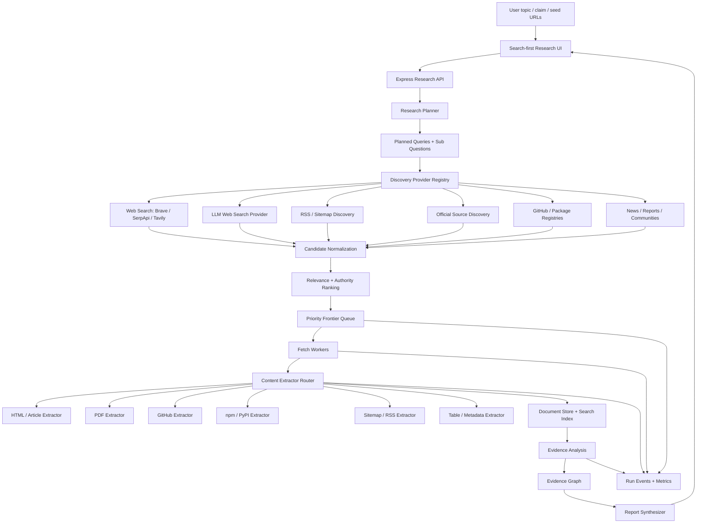

# PolitiStream Deep Research Crawler Upgrade Implementation Plan

> **For agentic workers:** REQUIRED SUB-SKILL: Use `superpowers:subagent-driven-development` (recommended) or `superpowers:executing-plans` to implement this plan task-by-task. Steps use checkbox (`- [ ]`) syntax for tracking.

**Goal:** 把 PolitiStream 从“RSS 新闻监控 + 初级网页研究”升级为“搜索优先、可持续深挖、可溯源、可审计的深度网络调查系统”。

**Architecture:** 前端保持搜索优先体验，后端将 Research 拆成 planner、discovery、frontier、fetcher、extractor、analysis、evidence、report、observability 九个边界清晰的模块。同步 API 只负责任务创建、状态查询和人工操作，长时间搜索、抓取、分析和报告生成交给 Postgres + Redis/BullMQ 驱动的后台 worker。

**Tech Stack:** React 19、Vite 6、TypeScript、Express、Postgres、Redis/BullMQ、SQLite、rss-parser、axios、JSDOM、Readability、Puppeteer、Gemini、Brave Search、SerpApi、Tavily，后续可接入 OpenAI/Perplexity 等具备 web search 能力的模型或 provider。

---

更新时间：2026-05-31 02:39:46 +0800

## 1. 目标与产品定位

PolitiStream 的目标不是再加几个 RSS 源，而是变成一个“研究助理型爬虫平台”。用户在首页搜索框输入一个课题、问题或待查证 claim 后，系统应自动完成：

1. 判断任务类型：横向调研、新闻溯源、产品评测、政策研究、技术选型、竞品分析。
2. 拆解研究子问题，生成多轮、多来源、多语言 query。
3. 调用搜索 provider、RSS、sitemap、官方站点、代码托管、包注册表、公开社区等 discovery 入口。
4. 对候选 URL 去重、归一化、分类、评分，进入 priority frontier。
5. 在预算内逐层抓取公开网页、文档、PDF、GitHub、npm/PyPI、表格页和站点地图。
6. 抽取内容、元数据、链接、引用关系、发布时间、作者、组织、附件和结构化表格。
7. 识别 claim、证据、冲突证据、来源质量和最早可验证出处。
8. 生成带引用、证据表、置信度、冲突点、不确定性和下一步建议的研究报告。

典型任务：

- “我想调研好用的文档转换工具，尤其是 Markdown、DOCX、PDF、PPT、表格互转，本地可跑、保真度好、适合自动化。”
- “查证某条新闻是否真实，找到最早出处、官方来源和传播路径。”
- “比较几个 AI 搜索产品的能力、价格、隐私策略和 API 质量。”
- “调研某项政策的官方文本、主流解读、反对意见和后续影响。”

## 2. 非目标与边界

本计划明确不做：

- 不绕过登录、验证码、付费墙、反爬验证和访问权限。
- 不做未授权数据采集，不抓取私人数据。
- 不把大模型回答当事实来源，模型只能做规划、抽取、分类、推理辅助和报告表达。
- 不做无限制全网爬取，每个 job 必须有 URL、域名、深度、时间、provider 成本和模型成本预算。
- 不在第一阶段把 SQLite 新闻库强行迁移到 Postgres，RSS 新闻功能继续可独立运行。
- 不要求第一版完成 DOCX/PDF 导出，报告先以 Markdown + UI 证据视图为主。

## 3. 当前仓库基线

当前项目已经具备一部分骨架，升级应复用现有代码，而不是推倒重来。

### 3.1 前后端与运行时

- `server.ts`：Express API 入口，负责 RSS、新闻、Research API，当前已从 Vite 中间件模式拆成独立后端。
- `vite.config.ts`：Vite 前端开发服务，默认代理 `/api/*` 到后端。
- `src/server/runtime.ts`：后端运行时配置，包含 `BACKEND_PORT`、`APP_URL`、`RSS_REFRESH_ON_STARTUP`。
- `src/App.tsx`：搜索优先首页、Research 分区、RSS Monitoring 分区、新闻流、收藏和 AI 队列入口。
- `src/components/ResearchPanel.tsx`：Research job 创建、运行、文档和报告展示。
- `src/components/RSSSourceManager.tsx`：RSS 源新增、启停、单源刷新。

### 3.2 RSS 新闻链路

- `src/server/services/rss.ts`：默认 RSS 源、用户 RSS 源、feed 抓取、正文补全、AI 摘要调度。
- `src/server/db.ts`：SQLite `news` 与 `rss_sources` 表。
- `src/server/services/ai.ts`：Gemini 摘要、情感分值、实体抽取。
- `src/server/services/storage.ts`：已分析新闻归档为 Markdown。

### 3.3 Research 链路

- `src/server/research/types.ts`：Research job、budget、candidate、document、evidence、report 类型。
- `src/server/research/queryPlanner.ts`：目前只根据 topic 生成少量字符串 query。
- `src/server/research/searchProviders.ts`：Brave、SerpApi、Tavily provider 适配和候选 URL 归一化。
- `src/server/research/crawler.ts`：Axios + JSDOM + Readability 抓公开网页、提取正文和链接。
- `src/server/research/run.ts`：同步执行 query planning、搜索、候选存储、抓取、证据抽取和报告。
- `src/server/research/store.ts`：Postgres schema 和 repository 方法。
- `src/server/research/routes.ts`：Research status、jobs、run、documents、report API。

### 3.4 主要缺口

1. Research run 仍偏同步，不适合 100 到 500 URL 的深度任务。
2. Query planner 只生成字符串，缺少任务类型、子问题、source type、freshness、purpose。
3. 搜索入口还只是 web search API，缺少 GitHub、npm/PyPI、sitemap、RSS、官方站点、论坛、报告源等 provider registry。
4. 抓到页面链接后没有真正进入 frontier queue 做多层扩展。
5. 没有 source authority、mainstream source、official source、primary source likelihood、topic relevance 等综合评分。
6. 内容抽取只覆盖 HTML 正文，PDF、GitHub、包注册表、表格页、sitemap、RSS、文档页都需要专用 extractor。
7. Evidence 仍是文档片段集合，没有形成 claim、supporting evidence、conflicting evidence、confidence、timeline 的证据图谱。
8. UI 对爬虫过程不够透明，用户看不到 query、provider、frontier、失败原因、成本、来源质量和证据链。
9. 缺少 benchmark task 和质量评估，无法判断“爬虫力度”是否真的提升。

## 4. 目标架构



核心原则：

- API 不做长任务，API 只创建 job、变更状态、返回进度和结果。
- Worker 做长任务，每个阶段可重试、可恢复、可观察。
- 所有模型输出必须有 JSON schema 校验，不能让模型隐式改变系统状态。
- 报告只从 evidence graph 生成，不能让模型凭空写结论。
- 每个来源、证据和结论必须能追溯到 URL、抓取时间和处理步骤。

## 5. 深度爬虫策略

### 5.1 研究计划生成

新增结构化 `ResearchPlan`，替代当前纯字符串 query plan。

```ts
export type ResearchTaskType =
  | "survey"
  | "verification"
  | "tool-evaluation"
  | "policy"
  | "technical"
  | "competitive"
  | "monitoring";

export type SourceType =
  | "official"
  | "mainstream-news"
  | "technical-doc"
  | "github"
  | "package-registry"
  | "academic"
  | "regulatory"
  | "community"
  | "benchmark"
  | "company"
  | "unknown";

export interface PlannedQuery {
  id: string;
  text: string;
  purpose:
    | "overview"
    | "official-source"
    | "primary-source"
    | "news-coverage"
    | "contradiction"
    | "benchmark"
    | "community-feedback"
    | "technical-detail"
    | "pricing"
    | "timeline";
  sourceTypes: SourceType[];
  language: string;
  priority: number;
}

export interface ResearchPlan {
  taskType: ResearchTaskType;
  topic: string;
  normalizedTopic: string;
  claim?: string;
  subQuestions: string[];
  languages: string[];
  freshness: "latest" | "historical" | "mixed";
  requiredSourceTypes: SourceType[];
  queries: PlannedQuery[];
  budget: ResearchBudget;
  stopConditions: string[];
}
```

Planner 生成逻辑：

1. 先用规则识别明显任务类型，例如“查证、溯源、真假”归为 `verification`，“好用、对比、推荐、工具”归为 `tool-evaluation`。
2. 如果 `GEMINI_API_KEY` 可用，使用 LLM 生成结构化 plan，并用 schema 校验。
3. 如果 LLM 不可用，使用规则 planner 生成保守计划，Research 仍可运行。
4. 对每个任务至少生成 8 到 20 条 query，覆盖 overview、official、primary、contradiction、community、benchmark、technical 等目的。
5. 每一轮抓取后，analysis worker 可以产生 `next_queries`，但必须受预算限制。

### 5.2 Discovery Provider Registry

统一 provider 接口：

```ts
export interface DiscoveryRequest {
  jobId: string;
  runId: string;
  query: PlannedQuery;
  budget: ResearchBudget;
}

export interface DiscoveryResult {
  provider: string;
  providerType:
    | "web-search"
    | "llm-web-search"
    | "rss"
    | "sitemap"
    | "github"
    | "package-registry"
    | "official"
    | "community";
  queryId: string;
  candidates: DiscoveredCandidate[];
  error?: string;
  costUnits?: number;
}

export interface DiscoveredCandidate {
  url: string;
  canonicalUrl: string;
  title: string;
  snippet?: string;
  sourceType: SourceType;
  providerRank?: number;
  publishedAt?: string;
  discoveredAt: string;
  raw?: unknown;
}
```

第一批 provider：

- Brave、SerpApi、Tavily，复用现有 `searchProviders.ts`。
- RSS provider，复用 `rss_sources` 中启用源，按 topic 检索近期 item。
- Sitemap provider，对 seed domain 和官方 domain 尝试 `sitemap.xml`。
- GitHub provider，搜索 repo、README、release、license、issues 活跃度。
- Package registry provider，覆盖 npm、PyPI，后续扩展 Homebrew、Docker Hub。
- Official discovery provider，根据 query 识别组织名、产品名、域名，优先查官网、政府、监管机构、标准组织。

### 5.3 Candidate 归一化与去重

所有 discovery 结果进入 candidate normalization：

- URL canonicalization：去掉 utm、fbclid、gclid、重复 slash、fragment。
- Domain normalization：`www.` 归一，保留 subdomain 信息。
- Content duplicate：抓取后用 content hash 去重。
- Search duplicate：同一 job 下 `canonicalUrl` 唯一。
- Near duplicate：标题高度相似、同域、同发布时间可降权。
- Source type inference：根据 URL、domain、provider、页面 metadata 和 query purpose 推断。

跳过规则：

- 登录页、注册页、广告页、搜索结果页、tag 列表页、无内容分页。
- 明显 tracking URL、短链跳转、重复参数页。
- 文件过大且不在高优先级来源中。
- robots 或站点策略不允许访问的页面。

### 5.4 Priority Frontier Queue

新增 `frontier_items`，让 crawler 能逐层深入。

```ts
export interface FrontierItem {
  id: string;
  jobId: string;
  runId: string;
  url: string;
  canonicalUrl: string;
  depth: number;
  sourceType: SourceType;
  priorityScore: number;
  discoveredFromUrl?: string;
  discoveredFromDocumentId?: string;
  queryId?: string;
  reason: string;
  status: "queued" | "fetching" | "fetched" | "failed" | "skipped";
  attempts: number;
  nextAttemptAt?: string;
  lastError?: string;
}
```

优先级公式：

```text
priorityScore =
  sourceAuthority * 0.25 +
  topicalRelevance * 0.25 +
  primarySourceLikelihood * 0.20 +
  freshness * 0.10 +
  sourceDiversity * 0.10 +
  linkContextQuality * 0.10
```

加分：

- 官方域名、政府、监管机构、标准组织、公司官网。
- 主流媒体、权威研究机构、项目官方文档、GitHub 官方 repo。
- 页面标题、snippet、anchor text 和 topic 高相关。
- 有明确发布日期、作者、组织、引用。
- 来自多个独立来源共同指向。

降权：

- SEO 聚合页、内容农场、无日期、无作者、标题党。
- 同域已经抓取过多。
- URL 参数复杂且疑似分页/追踪。
- 内容太短、重复、语言不匹配。

预算：

| 模式 | URL 上限 | 深度 | 域名上限 | 每域页面上限 | 目标耗时 |
| --- | ---: | ---: | ---: | ---: | --- |
| Quick | 30 | 1 | 10 | 5 | 1 到 3 分钟 |
| Standard | 150 | 2 | 40 | 10 | 5 到 15 分钟 |
| Deep | 500 | 3 | 100 | 20 | 20 到 60 分钟 |
| Monitor | 增量 | 1 | 按源配置 | 按源配置 | 持续 |

### 5.5 Fetch 与 Extractor Router

Fetcher 只负责拿到响应和基础安全限制，Extractor 根据 content type 和 URL pattern 分发。

Extractor 类型：

| 类型 | 识别方式 | 提取内容 |
| --- | --- | --- |
| HTML article | `text/html` + Readability 可解析 | 标题、正文、作者、发布时间、OpenGraph、links |
| Official docs | docs URL、sidebar、article/main selector | 正文、目录、版本、相邻文档链接 |
| GitHub repo | `github.com/<org>/<repo>` | README、stars、forks、license、release、issues 活跃度 |
| npm | `npmjs.com/package/*` 或 registry API | 版本、下载量、license、依赖、README |
| PyPI | `pypi.org/project/*` 或 JSON API | 版本、license、requires、release history |
| PDF | `application/pdf` 或 `.pdf` | 文本、页码、标题、元数据、引用 |
| Sitemap | `sitemap.xml` | URL、lastmod、priority |
| RSS/Atom | XML feed | item、pubDate、source |
| Table page | HTML table 密集页 | 表格结构、caption、上下文 |

Fetcher 限制：

- 默认 timeout 15 秒，Deep 模式可提高到 25 秒。
- HTML 最大 5 MB，PDF 最大 30 MB。
- 每域并发默认 1 到 2，全局并发默认 8 到 12。
- 重试最多 2 次，指数退避。
- Puppeteer 只作为高价值页面 fallback，不作为默认抓取方式。

### 5.6 LLM 使用策略

大模型位置：

```text
Planner LLM -> Search Providers -> Crawl/Extract -> Evidence LLM -> Evidence Graph -> Report LLM
```

允许模型做：

- 任务分类与子问题拆解。
- Query 扩展和下一轮搜索建议。
- Source type 判断和相关性初筛。
- Claim/evidence/conflict 抽取。
- 把 evidence graph 表达成报告。

不允许模型做：

- 不带来源给事实结论。
- 替代真实网页抓取。
- 引用不存在的来源。
- 在 schema 外生成隐式状态。

模型调用规则：

- 所有 LLM 输出必须用 JSON schema 校验。
- 每次模型调用要记录 prompt version、model、输入摘要、输出、token/cost。
- 长文档先分块和相关性过滤，只把高价值 chunk 送模型。
- 报告生成只喂 evidence graph、source profile、timeline 和 unresolved questions。

### 5.7 Evidence Graph

新增证据图谱，核心对象：

```ts
export interface EvidenceClaim {
  id: string;
  jobId: string;
  runId: string;
  claim: string;
  normalizedClaim: string;
  status: "supported" | "contradicted" | "uncertain" | "unverified";
  confidence: number;
  firstSeenAt?: string;
  primarySourceUrl?: string;
}

export interface EvidenceItem {
  id: string;
  jobId: string;
  runId: string;
  documentId: string;
  claimId?: string;
  sourceUrl: string;
  quote: string;
  paraphrase: string;
  relevanceScore: number;
  credibilityScore: number;
  supportsClaim?: boolean;
  contradictsClaim?: boolean;
  extractedAt: string;
}

export interface SourceProfile {
  id: string;
  domain: string;
  sourceType: SourceType;
  authorityTier: "T0" | "T1" | "T2" | "T3" | "T4";
  officialLikelihood: number;
  mainstreamLikelihood: number;
  notes: string[];
}
```

来源分层：

| Tier | 类型 | 示例 |
| --- | --- | --- |
| T0 | 原始官方来源 | 政府公告、法院文件、监管披露、公司声明、项目官网 |
| T1 | 主流权威来源 | 主流媒体、大学、研究机构、标准组织 |
| T2 | 高质量技术/社区来源 | GitHub 官方 repo、官方 docs、StackOverflow 高票答案 |
| T3 | 普通二手来源 | 博客、普通媒体转载、评测站 |
| T4 | 低可信来源 | SEO 农场、匿名转载、无日期无来源页面 |

## 6. 数据模型升级

Postgres 新增或扩展表：

| 表 | 作用 |
| --- | --- |
| `research_runs` | 每次运行的状态、阶段、预算、开始/结束时间 |
| `research_plans` | 结构化 ResearchPlan |
| `planned_queries` | 每条 query 的 purpose、source type、priority |
| `discovery_results` | provider 调用结果、错误、成本 |
| `frontier_items` | priority frontier 状态 |
| `document_links` | 页面外链、anchor、上下文、入队状态 |
| `document_assets` | PDF、图片、附件、下载结果 |
| `extracted_tables` | 表格结构化抽取 |
| `evidence_claims` | claim 状态、置信度、first seen |
| `source_profiles` | 域名和来源质量画像 |
| `run_events` | 每个阶段的日志、指标、错误 |
| `provider_usage` | provider 调用次数、失败率、成本 |
| `llm_usage` | 模型、token、prompt version、成本 |

索引：

- `research_runs(job_id, created_at DESC)`
- `planned_queries(job_id, purpose)`
- `frontier_items(job_id, status, priority_score DESC)`
- `frontier_items(job_id, canonical_url)` unique
- `crawl_documents(job_id, canonical_url)` unique
- `crawl_documents(content_hash)`
- `document_links(job_id, source_document_id)`
- `evidence_items(job_id, claim_id)`
- `source_profiles(domain)` unique
- `run_events(job_id, run_id, created_at DESC)`
- 后续可用 Postgres full text search 和 pgvector 做正文检索。

## 7. API 升级

保留现有 API，新增：

| 方法 | 路径 | 说明 |
| --- | --- | --- |
| `POST` | `/api/research/jobs/:id/runs` | 创建异步 run |
| `GET` | `/api/research/jobs/:id/runs` | run 历史 |
| `GET` | `/api/research/runs/:runId` | run 详情 |
| `POST` | `/api/research/runs/:runId/pause` | 暂停 run |
| `POST` | `/api/research/runs/:runId/resume` | 恢复 run |
| `POST` | `/api/research/runs/:runId/cancel` | 取消 run |
| `GET` | `/api/research/runs/:runId/events` | 运行事件 |
| `GET` | `/api/research/runs/:runId/plan` | 研究计划 |
| `GET` | `/api/research/runs/:runId/frontier` | frontier 状态 |
| `GET` | `/api/research/runs/:runId/sources` | 来源画像 |
| `GET` | `/api/research/runs/:runId/evidence` | 证据列表 |
| `GET` | `/api/research/runs/:runId/claims` | claim 图谱 |
| `POST` | `/api/research/runs/:runId/retry-failed` | 重试失败项 |
| `POST` | `/api/research/runs/:runId/queries` | 对某个子问题追加 query |

API 约束：

- 未配置 Postgres 时，Research API 返回明确配置错误，RSS 新闻 API 继续可用。
- 未配置 Redis 时，允许 Quick 同步降级运行，但 Standard/Deep 返回队列配置错误。
- 未配置 search provider 时，Research UI 要显示可运行能力受限，而不是静默失败。

## 8. UI 升级

### 8.1 首页

首页以搜索栏为主，用户输入课题后直接创建 Research job。新闻爬虫作为独立分区，用户点击 RSS Monitoring 才进入 RSS 源和新闻流。

搜索栏应支持：

- 任务类型自动识别。
- Quick / Standard / Deep 模式选择。
- Seed URL 输入。
- 是否包含中文/英文/多语言搜索。
- 是否优先官方来源、主流媒体、社区反馈、技术文档。

### 8.2 Research Run 页面

页面展示：

- 当前阶段：planning、discovery、frontier、fetching、extracting、analyzing、reporting、completed、failed。
- 生成的 sub questions 和 planned queries。
- Provider 调用状态、候选数、失败原因。
- Frontier 队列：queued、fetching、fetched、failed、skipped。
- Source type 分布、domain 分布、authority tier 分布。
- Evidence 数量、claim 数量、conflict 数量。
- 成本和预算：URL、域名、时间、provider 调用、LLM token。

### 8.3 Source Explorer

用户可以查看：

- 某个 URL 的标题、正文摘要、抓取状态、错误原因。
- 这个来源被哪些 claim 引用。
- 可信度评分和来源 tier。
- 页面发现的外链和哪些被入队。

### 8.4 Report View

报告视图支持：

- Executive Summary。
- Key Findings。
- Evidence Table。
- Source Quality。
- Timeline。
- Conflicting Claims。
- What Is Still Unclear。
- Recommended Next Searches。
- Full Source List。
- Markdown 导出，后续再加 PDF/DOCX。

## 9. 分阶段实施计划

每个 phase 都应通过 OpenSpec 拆成独立 change，生成 issues CSV 后逐条实现。

### Phase 0：运行时与现有产品加固

**目标：** 让前后端分离、配置降级、RSS 启动行为和基础状态页稳定。

**Files:**

- Modify: `server.ts`
- Modify: `vite.config.ts`
- Modify: `package.json`
- Modify: `.env.example`
- Modify: `src/App.tsx`
- Modify: `src/types.ts`
- Create/Modify: `src/server/runtime.ts`
- Create/Modify: `src/server/runtime.test.ts`
- Modify: `README.md`
- Modify: `docs/frontend-backend-crawler-architecture.md`

- [ ] 确认 `BACKEND_PORT`、`FRONTEND_PORT`、`APP_URL`、`VITE_API_PROXY_TARGET`、`RSS_REFRESH_ON_STARTUP` 均可配置。
- [ ] 确认启动时不会默认全量刷新 RSS，除非 `RSS_REFRESH_ON_STARTUP=true`。
- [ ] 确认 `/api/runtime/status` 和 `/api/research/status` 在缺配置时也能返回可读状态。
- [ ] 确认没有 Postgres、Redis、Gemini、search key 时，RSS 新闻功能仍可用。
- [ ] 验证命令：

```bash
npm run test:runtime
npm run test:research
npm run lint
npm run build
```

**Acceptance:**

- 前端默认 `http://localhost:3000` 可访问。
- 后端默认 `http://localhost:3001/api/health` 返回 ok。
- 首页 3 秒内可打开，不被 RSS 全量抓取阻塞。

### Phase 1：高级 Research Planner

**目标：** 从简单关键词搜索升级为结构化研究计划。

**Files:**

- Modify: `src/server/research/types.ts`
- Replace/Extend: `src/server/research/queryPlanner.ts`
- Create: `src/server/research/plannerSchema.ts`
- Create: `src/server/research/plannerFallback.ts`
- Create: `src/server/research/plannerAi.ts`
- Modify: `src/server/research/store.ts`
- Modify: `src/server/research/run.ts`
- Modify: `src/server/research/research.test.ts`
- Modify: `src/components/ResearchPanel.tsx`

- [ ] 新增 `ResearchPlan`、`PlannedQuery`、`ResearchTaskType`、`SourceType` 类型。
- [ ] 写 planner fallback 测试，覆盖“文档转换工具”和“新闻查证”。
- [ ] 实现规则 planner，确保无 Gemini 时仍能生成 plan。
- [ ] 实现 Gemini planner，输出 JSON 后做 schema 校验，失败时回退规则 planner。
- [ ] 将 `research_jobs.query_plan` 兼容旧字符串数组，同时新增 `research_plans` 和 `planned_queries`。
- [ ] UI 展示 task type、sub questions、queries、source type 和 budget。
- [ ] 验证命令：

```bash
npm run test:research
npm run lint
npm run build
```

**Acceptance:**

- 输入“好用的文档转换工具”，生成 `tool-evaluation` plan。
- 输入“查证某条新闻是否真实”，生成 `verification` plan。
- 每个 query 有 purpose、source type、language、priority。

### Phase 2：Discovery Provider Registry

**目标：** 让系统不只依赖通用 web search，而是能从多种网络入口发现来源。

**Files:**

- Create: `src/server/research/discovery/types.ts`
- Create: `src/server/research/discovery/registry.ts`
- Move/Modify: `src/server/research/searchProviders.ts`
- Create: `src/server/research/discovery/rssProvider.ts`
- Create: `src/server/research/discovery/sitemapProvider.ts`
- Create: `src/server/research/discovery/githubProvider.ts`
- Create: `src/server/research/discovery/packageProvider.ts`
- Create: `src/server/research/discovery/officialProvider.ts`
- Modify: `src/server/research/store.ts`
- Modify: `src/server/research/run.ts`
- Modify: `src/server/research/research.test.ts`

- [ ] 定义统一 `DiscoveryProvider` 接口。
- [ ] 将 Brave、SerpApi、Tavily 包装为 provider registry。
- [ ] 新增 RSS discovery，从现有 `rss_sources` 找近期相关新闻。
- [ ] 新增 sitemap discovery，支持 seed domain 和官方域名。
- [ ] 新增 GitHub discovery，优先官方 repo、README、release。
- [ ] 新增 npm/PyPI discovery，覆盖工具评测任务。
- [ ] 存储 provider result、错误和 cost units。
- [ ] 验证命令：

```bash
npm run test:research
npm run lint
```

**Acceptance:**

- 一个 Standard job 至少能从 3 类 provider 得到候选来源。
- 每个候选 URL 带 provider、providerType、sourceType、queryId、rank。
- 缺某个 provider key 不影响其他 provider 运行。

### Phase 3：Frontier Queue 与 Worker 化

**目标：** 让爬虫可以逐层深入，长任务不阻塞 API 请求。

**Files:**

- Create: `src/server/research/frontier/types.ts`
- Create: `src/server/research/frontier/scoring.ts`
- Create: `src/server/research/frontier/store.ts`
- Create: `src/server/research/workers/queues.ts`
- Create: `src/server/research/workers/discoveryWorker.ts`
- Create: `src/server/research/workers/fetchWorker.ts`
- Create: `src/server/research/workers/analysisWorker.ts`
- Create: `src/server/research/workers/reportWorker.ts`
- Create: `src/server/research/workers/worker.ts`
- Modify: `src/server/research/routes.ts`
- Modify: `src/server/research/store.ts`
- Modify: `package.json`

- [ ] 新增 `research_runs` 和 `frontier_items` 表。
- [ ] 实现 priority score 计算和 URL 入队。
- [ ] 实现 per-domain limit、depth limit、URL limit、domain limit。
- [ ] 引入 BullMQ 队列，API 创建 run 后返回 queued 状态。
- [ ] fetch worker 抓取页面后把新链接按评分入 frontier。
- [ ] 支持 pause、resume、cancel。
- [ ] 验证命令：

```bash
npm run test:research
npm run lint
npm run build
```

**Acceptance:**

- Deep 模式能处理 300+ URL，API 请求不阻塞。
- 抓取页面后能提取链接并按优先级进入下一层。
- 失败 URL 有 retry/cooldown，不影响整个 run 继续。

### Phase 4：多类型内容抽取

**目标：** 从“抓网页正文”升级为“按内容类型提取结构化信息”。

**Files:**

- Create: `src/server/research/extractors/types.ts`
- Create: `src/server/research/extractors/router.ts`
- Create: `src/server/research/extractors/htmlExtractor.ts`
- Create: `src/server/research/extractors/pdfExtractor.ts`
- Create: `src/server/research/extractors/githubExtractor.ts`
- Create: `src/server/research/extractors/npmExtractor.ts`
- Create: `src/server/research/extractors/pypiExtractor.ts`
- Create: `src/server/research/extractors/sitemapExtractor.ts`
- Create: `src/server/research/extractors/tableExtractor.ts`
- Modify: `src/server/research/crawler.ts`
- Modify: `src/server/research/store.ts`
- Modify: `src/server/research/research.test.ts`

- [ ] 定义 `ExtractedDocument`、`ExtractedLink`、`ExtractedTable`、`ExtractedAsset`。
- [ ] HTML extractor 继续使用 Readability，但补 OpenGraph、JSON-LD、meta、author、publishedAt。
- [ ] PDF extractor 抽文本和页码，超过大小预算则跳过并记录原因。
- [ ] GitHub extractor 抽 README、stars、license、release、issues 活跃度。
- [ ] npm/PyPI extractor 调 registry API 抽版本、下载量、license、依赖。
- [ ] Table extractor 保留表头、行、caption 和上下文。
- [ ] 验证命令：

```bash
npm run test:research
npm run lint
```

**Acceptance:**

- “文档转换工具”任务能抓官网、GitHub、npm/PyPI、文档页。
- PDF 能抽取文本和页码。
- GitHub repo 能抽取 README、stars、license、release。

### Phase 5：Relevance、Credibility 与 Evidence Graph

**目标：** 从“网页摘要”升级为“证据系统”。

**Files:**

- Create: `src/server/research/scoring/relevance.ts`
- Create: `src/server/research/scoring/credibility.ts`
- Create: `src/server/research/evidence/types.ts`
- Create: `src/server/research/evidence/extractClaims.ts`
- Create: `src/server/research/evidence/extractEvidence.ts`
- Create: `src/server/research/evidence/conflicts.ts`
- Create: `src/server/research/evidence/sourceProfiles.ts`
- Modify: `src/server/research/analysis.ts`
- Modify: `src/server/research/reports.ts`
- Modify: `src/server/research/store.ts`
- Modify: `src/server/research/research.test.ts`

- [ ] 实现 source profile 和 authority tier。
- [ ] 实现 topic relevance 和 credibility score。
- [ ] 从文档中抽取 claims、supporting evidence、contradicting evidence。
- [ ] 为 verification 任务建立 timeline 和 first seen candidates。
- [ ] 报告生成从 evidence graph 读取，不直接总结所有原文。
- [ ] 验证命令：

```bash
npm run test:research
npm run lint
```

**Acceptance:**

- 每个关键结论至少绑定一个 evidence item。
- 报告能区分支持来源和冲突来源。
- 新闻溯源任务能输出 earliest source candidates 和时间线。

### Phase 6：Research UI 与报告体验

**目标：** 让用户看得懂系统为什么得出结论，也能继续深挖。

**Files:**

- Modify: `src/App.tsx`
- Modify: `src/components/ResearchPanel.tsx`
- Create: `src/components/research/ResearchRunView.tsx`
- Create: `src/components/research/ResearchPlanView.tsx`
- Create: `src/components/research/FrontierView.tsx`
- Create: `src/components/research/SourceExplorer.tsx`
- Create: `src/components/research/EvidenceTable.tsx`
- Create: `src/components/research/ReportView.tsx`
- Modify: `src/types.ts`
- Modify: `src/index.css`

- [ ] Search home 支持 Quick/Standard/Deep 和 seed URL。
- [ ] Research Run 页面展示阶段、queries、providers、frontier、sources、evidence、cost。
- [ ] Source Explorer 展示来源原文摘要、证据引用、抓取错误和外链。
- [ ] Report View 支持 evidence cards、confidence badge、conflict badge、source list。
- [ ] 支持对某个 sub question 追加 query 或重跑。
- [ ] 验证命令：

```bash
npm run lint
npm run build
```

**Acceptance:**

- 用户能从报告点击到原始网页和证据摘录。
- 用户能看到某个结论的来源质量和冲突信息。
- 用户能对某个子问题继续搜索。

### Phase 7：可观测性、评估与成本控制

**目标：** 让系统可长期运行、可比较质量、可控制成本。

**Files:**

- Create: `src/server/research/observability/events.ts`
- Create: `src/server/research/observability/metrics.ts`
- Create: `src/server/research/observability/providerUsage.ts`
- Create: `src/server/research/observability/llmUsage.ts`
- Create: `src/server/research/evaluation/benchmarkTasks.ts`
- Create: `src/server/research/evaluation/scoreRun.ts`
- Modify: `src/server/research/routes.ts`
- Modify: `src/components/research/ResearchRunView.tsx`
- Modify: `README.md`

- [ ] 每个 run 记录 stage transition、provider call、fetch attempt、extract result、LLM call、report generation。
- [ ] 记录 provider 成功率、失败率、耗时和 cost units。
- [ ] 记录 LLM token、模型、prompt version 和解析失败率。
- [ ] 建立 benchmark tasks，至少覆盖工具调研和新闻溯源。
- [ ] 输出 job quality score：coverage、source diversity、evidence density、conflict coverage、citation quality。
- [ ] 验证命令：

```bash
npm run test
npm run lint
npm run build
```

**Acceptance:**

- 每个 job 有完整运行日志。
- UI 能看到 provider 调用次数、失败原因和成本。
- 能对比不同版本 crawler 在同一 benchmark 上的质量。

## 10. OpenSpec 拆分建议

不要用一个超大 change 一次做完。建议拆成：

1. `fix-dev-runtime-config`
2. `add-research-planner`
3. `add-discovery-provider-registry`
4. `add-frontier-queue`
5. `add-research-workers`
6. `add-content-extractors`
7. `add-evidence-graph`
8. `add-source-credibility-scoring`
9. `update-research-report-ui`
10. `add-research-observability`
11. `add-research-benchmarks`

每个 change 需要：

- `proposal.md` 描述目标、范围、风险。
- `design.md` 说明架构决策和替代方案。
- `specs/**/*.md` 写可验收 Scenario。
- `tasks.md` 拆成小任务。
- issues CSV 逐条实现、review、测试和提交。

## 11. 测试与验收矩阵

### 11.1 自动化测试

| 层 | 命令 | 覆盖 |
| --- | --- | --- |
| Runtime | `npm run test:runtime` | 端口、APP_URL、RSS startup 配置 |
| Research unit | `npm run test:research` | planner、provider normalize、budget、report |
| Typecheck | `npm run lint` | TypeScript 类型完整性 |
| Build | `npm run build` | 前端构建和静态资源 |
| Full base | `npm run test && npm run lint && npm run build` | 每阶段完成前必须跑 |

### 11.2 手工验收

RSS 最小模式：

```bash
npm run dev:backend
npm run dev:frontend
```

- 打开 `http://localhost:3000`。
- RSS Monitoring 可以加载源列表。
- 新增 RSS 源后可刷新单源。
- 没有 Gemini 时新闻仍可展示。

Research 配置缺失模式：

- 不配置 `DATABASE_URL` 和 search keys。
- 首页状态明确显示 Research DB 或 providers 缺失。
- 创建/运行 Research 不应静默失败。

Research 标准模式：

- 配置 Postgres、Redis、至少一个 search provider。
- 输入“好用的文档转换工具”。
- 选择 Standard。
- 系统展示 plan、query、provider、frontier、documents、evidence、report。

### 11.3 Benchmark 场景

场景 A，文档转换工具调研：

- 应发现 Pandoc、LibreOffice、Mammoth、docx、python-docx、unoconv、Calibre、CloudConvert、MarkItDown 等候选。
- 应覆盖官网、GitHub、包注册表、官方文档、社区讨论。
- 报告应包含功能矩阵、保真度、自动化能力、隐私、本地化、价格和推荐排序。

场景 B，新闻查证溯源：

- 应提取核心 claim。
- 应搜索主流报道、官方声明、原始文件、公司/政府页面。
- 应输出 first seen candidates、timeline、支持证据、冲突证据和置信度。

场景 C，政策研究：

- 应优先抓官方文本、监管机构、研究机构、主流媒体、反对观点。
- 应输出政策原文、关键条款、利益相关方、争议点和影响分析。

## 12. 性能、成本与安全策略

性能：

- Quick 默认 30 URL，Standard 默认 150 URL，Deep 默认 500 URL。
- 单域名并发默认 1 到 2。
- 全局 fetch 并发默认 8 到 12。
- Provider 调用按 query priority 执行，低优先级 query 在预算不足时跳过。
- 内容 hash 去重，已抓取 canonical URL 不重复抓。

成本：

- 先抓取和规则评分，再决定是否调用 LLM。
- 只对高相关、高权威、或冲突关键文档做 evidence LLM。
- 长文档分块，只送相关 chunk。
- 报告使用 evidence graph，不把所有原文塞入上下文。

安全与合规：

- 尊重 robots 和站点访问限制。
- 设置清晰 User-Agent：`PolitiStreamResearchBot`。
- 不访问登录态页面，不绕过验证码和付费墙。
- 保存抓取时间、URL、状态、错误和来源。
- 对 401、403、451 记录 `blocked`，不反复攻击。

## 13. 迁移与回滚

迁移顺序：

1. 先新增表和新 API，保持旧 Research 字段兼容。
2. Worker 化前保留 Quick 同步运行作为 fallback。
3. UI 先读新 API，缺字段时使用旧 `ResearchJob.queryPlan`。
4. 每个 phase 完成后更新 README 和架构文档。

回滚：

- 去掉 `DATABASE_URL` 可禁用深度研究链路，RSS/新闻继续使用 SQLite。
- 去掉 `REDIS_URL` 可禁用 Standard/Deep worker，仅保留 Quick 或配置缺失提示。
- Search provider key 缺失时，仅禁用对应 provider。
- 新增 extractor 出错时，fallback 到 HTML Readability 或标记 `failed`，不阻断 run。

## 14. 推荐实施顺序

最优先三件事：

1. `add-research-planner`，让搜索不再只是关键词，而是可解释研究计划。
2. `add-frontier-queue`，让 crawler 真正能够逐层深入。
3. `add-evidence-graph`，让报告从“摘要”升级为“可审计结论”。

建议节奏：

- 第一周：Planner + provider registry。
- 第二周：Frontier + worker queue。
- 第三周：extractor router + GitHub/npm/PyPI/PDF。
- 第四周：evidence graph + report UI。
- 第五周：observability + benchmark + 性能调优。

每个 phase 的完成标准：

- 自动化测试通过。
- README 和相关 docs 更新。
- UI 可展示降级状态。
- 至少一个手工 benchmark 场景跑通。
- 没有把临时脚本、数据库、缓存、`.env`、本地代理配置提交进代码。

